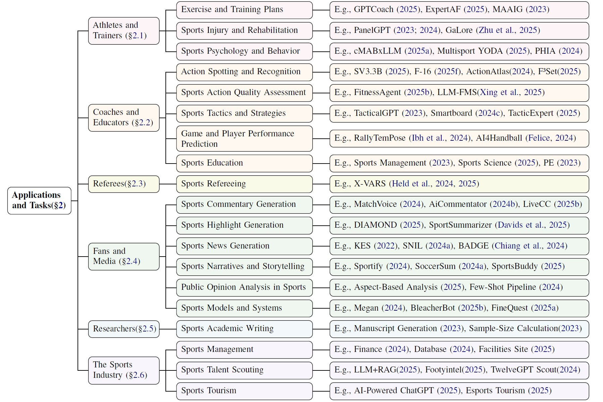

<!-- # Awesome-Large-Models-In-Sports
The official repository of paper "A Survey of Large Models in Sports" -->

<!-- # Large Models in Sports (LMSports)

This repository is the reading list on ***A Survey of Large Models in Sports***. The current deadline for included papers is **July 2025**. -->

  <h1 align="center">Large Models in Sports</h1>
  

    This repository accompanies our survey paper:  
    <a href="https://arxiv.org/pdf/2506.23918"><strong>A Survey of Large Models in Sports</strong></a>
  

  
   
  
   
  

---

## 🔔 News
-   **[2025-10]** We have released ["A Survey of Large Models in Sports"](https://arxiv.org/pdf/2506.23918), a **comprehensive survey** dedicated to the emerging application of Large Models (LMs) in sports. 
-   **[2025-10]** We created this repository to maintain a paper list on Awesome-Large-Models-In-Sports. Contributions are welcome!

---

## Introduction

Welcome to **Awesome-Large-Models-In-Sports** 👋  
Sports have witnessed a surge of global enthusiasm, becoming a driving force for physical health, social connection, and cultural exchange. With the rapid rise of **Large Language Models (LLMs)** and **Multimodal Large Language Models (MLLMs)**, **Large Models (LMs)** is transforming how we understand, analyze, and interact with sports. This repository is the **first comprehensive survey and curated collection** that systematically explores the intersection of **Large Models and sports**.

We organize the applications into **six major stakeholder groups**, as shown in the figure below:

1. **Athletes & Trainers** – exercise and training plans, injury prevention, rehabilitation, and sports psychology  
2. **Coaches & Educators** – action recognition, performance prediction, and tactics or strategies  
3. **Referees** – decision support, fairness, and explainable refereeing systems  
4. **Fans & Media** – commentary, highlights, storytelling, news, sentiment analysis and general sports models
5. **Researchers** – academic writing and knowledge discovery in sports science  
6. **The Sports Industry** – management, talent scouting, and tourism applications  

  

We further structure the repository following the **taxonomy tree** introduced in our paper, offering a clear overview of research topics, tasks, and datasets within each stakeholder group.

  

This collection serves as an open, evolving resource for **researchers, developers, and sports enthusiasts** eager to explore the forefront of AI in sports — and to discover what large models can bring to the next generation of **sports intelligence**.

## Table of Contents

- [Applications for Athletes and Trainers](#applications-for-athletes-and-trainers)
  - [Training Perscription and Plans](#training-perscription-and-plans)
  - [Sports Injury and Rehabilitation](#sports-injury-and-rehabilitation)
  - [Sports Psychology and Behavior](#sports-psychology-and-behavior)
- [Applications for Coaches and Educators](#applications-for-coaches-and-educators)
  - [Action Spotting and Recognition](#action-spotting-and-recognition)
  - [Sports Action Quality Assessment](#sports-action-quality-assessment)
  - [Sports Tactics and Strategies](#sports-tactics-and-strategies)
  - [Game and Player Performance Prediction](#game-and-player-performance-prediction)
  - [Sports Education](#sports-education)
- [Applications for Referees](#applications-for-referees)
  - [Sports Refereeing](#sports-refereeing)
- [Applications for Fans and Social Media](#applications-for-fans-and-social-media)
  - [Sports Commentary Generation](#sports-commentary-generation)
  - [Sports Highlight Generation](#sports-highlight-generation)
  - [Sports News Generation](#sports-news-generation)
  - [Sports Narratives and Storytelling](#sports-narratives-and-storytelling)
  - [Public Opinion Analysis in Sports](#public-opinion-analysis-in-sports)
  - [Sports Models and Systems](#sports-models-and-systems)
- [Applications for Researchers](#applications-for-researchers)
  - [Sports Academic Writing](#sports-academic-writing)
- [Applications for the Sports Industry](#applications-for-the-sports-industry)
  - [Sports Management](#sports-management)
  - [Sports Talent Scouting](#sports-talent-scouting)
  - [Sports Tourism](#sports-tourism)
- [Sports Understanding](#sports-understanding)
  - [Specialized Sports Understanding](#specialized-sports-understanding)
  - [General Video Understanding](#general-video-understanding)
- [Related Surveys](#related-surveys)
- [Years](#years)
  - [2020](#2020)
  - [2021](#2021)
  - [2022](#2022)
  - [2023](#2023)
  - [2024](#2024)
  - [2025](#2025)

## Applications for Athletes and Trainers

### Training Perscription and Plans

1. **Artificial Intelligence in Sport: Exploring the Potential of Using ChatGPT in Resistance Training Prescription**, Biology of sport 2024 [[paper](https://www.termedia.pl/Artificial-intelligence-in-sport-Exploring-the-potential-of-using-r-nChatGPT-in-resistance-training-prescription,78,51817,0,1.html )]
2. **Using Artificial Intelligence for Exercise Prescription in Personalised Health Promotion: a Critical Evaluation of OpenAI’s GPT-4 Model**, Biology of Sport 2024 [[paper](https://www.termedia.pl/Using-artificial-intelligence-for-exercise-prescription-in-personalised-health-promotion-A-critical-evaluation-of-OpenAI-s-GPT-4-model,78,52030,1,1.html)]
3. **ChatGPT and Exercise Prescription: Human vs. Machine or Human Plus Machine?**, Journal of Sport and Health Science 2024 [[paper](https://www.sciencedirect.com/science/article/pii/S2095254623001060)]
4. **Infusing Behavior Science into Large Language Models for Activity Coaching**, PLOS Digital Health 2024 [[paper](https://journals.plos.org/digitalhealth/article?id=10.1371/journal.pdig.0000431)]
5. **The Potential of Large Language Model Chatbots for Application to Epilepsy: Let’s Talk About Physical Exercise**, Epilepsy & Behavior Reports 2024 [[paper](https://www.sciencedirect.com/science/article/pii/S2589986424000492)]
6. **Towards a Personal Health Large Language Model**, AIM-FM Workshop @ NeurIPS'24 Oral 2024 [[paper](https://openreview.net/forum?id=1Fbna6cNPw)]
7. **Visualizing Exercise Data from Combat Exergame for Exploring the Insight from Personal Informatics with Large Language Models**, CHI EA 2025 [[paper](https://dl.acm.org/doi/abs/10.1145/3706599.3720165)]
8. **Reproducibility and Quality of Hypertrophy-Related Training Plans Generated by GPT-4 and Google Gemini as Evaluated by Coaching Experts**, Biology of Sport 2025 [[paper]( https://pubmed.ncbi.nlm.nih.gov/40182716/)]
9. **Evaluating the Potential Role of AI Chatbots in Designing Personalized Exercise Programs for Weight Management**, International Journal of Human–Computer Interaction 2025 [[paper](https://www.tandfonline.com/doi/full/10.1080/10447318.2025.2462752)]
10. **Acceptance and Trust in AI-Generated Exercise Plans Among Recreational Athletes and Quality Evaluation by Experienced Coaches a Pilot Study**, BMC Research Notes 2025 [[paper](https://bmcresnotes.biomedcentral.com/articles/10.1186/s13104-025-07172-9)]
11. **Can People with Epilepsy Trust AI Chatbots for Information on Physical Exercise?**,  Epilepsy & Behavior 2025 [[paper](https://www.sciencedirect.com/science/article/pii/S1525505024005754)]
12. **GPTCoach: Towards LLM-Based Physical Activity Coaching**, CHI 2025 [[paper](https://dl.acm.org/doi/abs/10.1145/3706598.3713819)]
13. **Digital Coaches: an Alternative to Expert Coaches for Men's Fitness Goals**, Physical Activity Review 2025 [[paper](https://www.researchgate.net/publication/392219663_Digital_coaches_an_alternative_to_expert_coaches_for_men's_fitness_goals)]
14. **A Multi-Agent Digital Twin Framework for AI-Driven Fitness Coaching**, IMX 2025 [[paper](https://dl.acm.org/doi/10.1145/3706370.3731651)]
15. **GPT‑ 4 as a Virtual Fitness Coach: a Case Study Assessing Its Effectiveness in Providing Weight Loss and Fitness Guidance**, BMC Public Health 2025 [[paper](https://bmcpublichealth.biomedcentral.com/articles/10.1186/s12889-025-22739-8)]
16. **T3Set: a Multimodal Dataset with Targeted Suggestions for LLM-Based Virtual Coach in Table Tennis Training**, KDD 2025 [[paper](https://dl.acm.org/doi/10.1145/3711896.3737407)]
17. **Table Tennis Coaching System Based on a Multimodal Large Language Model with a Table Tennis Knowledge Base**, PloS one 2025 [[paper](https://journals.plos.org/plosone/article?id=10.1371/journal.pone.0317839)]
18. **Enhancing Athletic Performance Through AI: an Iterative Prompt Engineering Approach for LLM-Based Coaching Feedback**, International Conference on Human-Computer Interaction 2025 [[paper](https://link.springer.com/chapter/10.1007/978-3-031-94171-9_22)]
19. **Intent-Aware Personalized Feedback Generation from Coach-Athlete Dialogues in Sports Training**, Journal of King Saud University Computer and Information Sciences 2025 [[paper](https://link.springer.com/article/10.1007/s44443-025-00165-5)]
20. **Balancing Act: Generative AI Tools and Scope of Practice in Health Coaching**, American Journal of Health Promotion 2025 [[paper](https://journals.sagepub.com/doi/abs/10.1177/08901171251340383)]
21. **Examining the Ability of Artificial Intelligence with ChatGPT-4.0 to Create an Exercise Program: Case Scenario Examples "Lumbar Disc Herniation, Chronic Migraine, and Urge Urinary Incontinence**, Turkish Journal of Kinesiology 2025[[paper](https://dergipark.org.tr/en/pub/turkjkin/issue/90094/1617953)]
22. **ChatGPT-4o-Generated Exercise Plans for Patients with Type 2 Diabetes Mellitus—Assessment of Their Safety and Other Quality Criteria by Coaching Experts**, IEEE Access 2025 [[paper](https://www.mdpi.com/2075-4663/13/4/92)]
23. **Harnessing Generative Artificial Intelligence for Exercise and Training Prescription: Applications and Implications in Sports and Physical Activity—A Systematic Literature Review**, Applied Sciences 2025 [[paper](https://www.mdpi.com/2076-3417/15/7/3497)]
24. **Optimizing Athletic Performance Through Advanced Nutrition Strategies: Can AI and Digital Platforms Have a Role in Ultraendurance Sports?**, Biology of Sport 2024 [[paper](https://www.termedia.pl/Optimizing-athletic-performance-through-advanced-nutrition-r-nstrategies-can-AI-and-digital-platforms-have-a-role-in-ultraendurance-sports-,78,54384,0,1.html)]
25. **The Sports Nutrition Knowledge of Large Language Model (LLM) Artificial Intelligence (AI) Chatbots: an Assessment of Accuracy, Completeness, Clarity, Quality of Evidence, and Test-Retest Reliability**, PLOS One 2025 [[paper](https://journals.plos.org/plosone/article?id=10.1371/journal.pone.0325982)]
26. **ExpertAF: Expert Actionable Feedback from Video**, CVPR 2025 [[paper](https://openaccess.thecvf.com/content/CVPR2025/html/Ashutosh_ExpertAF_Expert_Actionable_Feedback_from_Video_CVPR_2025_paper.html)]
27. **LEGOLAS: Learning & Enhancing Golf Skills Through LLM-Augmented System**, CHI EA 2025 [[paper](https://dl.acm.org/doi/10.1145/3706599.3720141)]
28. **Expert Comment Generation Considering Sports Skill Level Using a Large Multimodal Model with Video and Spatial-Temporal Motion Features**, Sensors 2025 [[paper](https://www.mdpi.com/1424-8220/25/2/447)]
29. **MAAIG: Motion Analysis and Instruction Generation**, MM Asia 2023 [[paper](https://arxiv.org/abs/2311.00980)]
30. **MotionGPT-2: a General-Purpose Motion-Language Model for Motion Generation and Understanding**, arXiv:2410.21747 [[paper](https://arxiv.org/abs/2410.21747)]
31. **CoachMe: Decoding Sport Elements with a Reference-Based Coaching Instruction Generation Model**, ACL 2025 [[paper](https://aclanthology.org/2025.acl-long.1413/)]
32. **Who Could and Should Give Exercise Prescription: Physicians, Exercise and Health Scientists, Fitness Trainers, or ChatGPT?**, Journal of Sport and Health Science 2024 [[paper](https://www.sciencedirect.com/science/article/pii/S2095254624000012)]
33. **Does ChatGPT Provide Comprehensive and Accurate Information Regarding the Effects, Types and Programming of Core Exercises?**, Turkish Journal of Kinesiology 2024 [[paper](https://dergipark.org.tr/en/pub/turkjkin/article/1516614)]
34. **ChatGPT Generated Training Plans for Runners Are Not Rated Optimal by Coaching Experts, but Increase in Quality with Additional Input Information**, Journal of sports science & medicine 2024 [[paper](https://pmc.ncbi.nlm.nih.gov/articles/PMC10915606/)]
35. **The Impact of LLM Hallucinations on Motor Skill Learning: a Case Study in Badminton**, IEEE Access 2024 [[paper](https://ieeexplore.ieee.org/abstract/document/10638024)]
36. **RAG-LLM Based Evaluation Pathway and Technological Exploration for the Scientific Validity of Mass Fitness**, ASSC 6th 2025 [[paper](https://www.researchgate.net/profile/Kyungsik-Kim-6/publication/393279373_E-proceeding_of_2025_6th_Asia_Sport_Science_Conference/links/6864f099b991270ef300f0cc/E-proceeding-of-2025-6th-Asia-Sport-Science-Conference.pdf#page=272)]
37. **Characteristics and Perceived Suitability of Artificial Intelligence-Driven Sports Coaches: a Pilot Study on Psychological and Perceptual Factors**, Frontiers in Sports and Active Living 2025 [[paper](https://www.frontiersin.org/journals/sports-and-active-living/articles/10.3389/fspor.2025.1548980/full)]
38. **Assessment of Personalized Exercise Prescriptions Issued by ChatGPT 4.0 and Intelligent Health Promotion Systems for Patients with Hypertension Comorbidities Based on the Transtheoretical Model: A Comparative Analysis**, Journal of Multidisciplinary Healthcare 2024 [[paper](https://www.tandfonline.com/doi/full/10.2147/JMDH.S477452)]
39. **A 10-Week Large Language Model (LLM)-Generated Versus Human-Made Volleyball Training Program on the Jumping Performance of Collegiate Volleyball Athletes**, Journal of Physical Education 2025 [[paper](https://www.scielo.br/j/jpe/a/TQjv6PxVVQcx47xd4FQfqzx/?lang=en)]
40. **The AI Coach: A 5-Week AI-Generated Calisthenics Training Program on Health-Related Physical Fitness Components of Untrained Collegiate Students**, Journal of Human Sport and Exercise 2025 [[paper](https://www.jhse.es/index.php/jhse/article/view/ai-generated-calisthenics-training-program)]
41. **The Effects of Chat GPT Generated Exercise Program in Healthy Overweight Young Adults: A Pilot Study**, Journal of Human Sport and Exercise 2025 [[paper](https://www.jhse.es/index.php/jhse/article/view/gpt-chat-generated-exercise-program-healthy-overweight-young-adu)]
42. **Promises and Perils of Generative Artificial Intelligence: A Narrative Review Informing Its Ethical and Practical Applications in Clinical Exercise Physiology**, BMC Sports Science, Medicine and Rehabilitation 2025 [[paper](https://link.springer.com/article/10.1186/s13102-025-01182-7)]

### Sports Injury and Rehabilitation

1. **The Role of ChatGPT in Sports Trauma: a Mini Review on Strengths and Limits of Open AI Application**, Discover Artificial Intelligence 2023 [[paper](https://link.springer.com/article/10.1007/s44163-023-00093-1)]
2. **Interdisciplinary Inquiry via PanelGPT: Application to Explore Chatbot Application in Sports Rehabilitation**, medRxiv 2023 [[paper](https://pmc.ncbi.nlm.nih.gov/articles/PMC10402232/)]
3. **Artificial Intelligence in Sports Medicine: Could GPT-4 Make Human Doctors Obsolete?**, Annals of Biomedical Engineering 2023 [[paper](https://link.springer.com/article/10.1007/s10439-023-03213-1)]
4. **Artificial Intelligence and ChatGPT in Orthopaedics and Sports Medicine**, Journal of Experimental Orthopaedics 2023 [[paper](https://link.springer.com/article/10.1186/s40634-023-00642-8)]
5. **Chatbot Generative Pre-Trained Transformer and Artificial Intelligence in Sports Physical Therapy and Rehabilitation**, Saudi Journal of Sports Medicine 2023 [[paper](https://journals.lww.com/sjsm/fulltext/2023/23020/chatbot_generative_pre_trained_transformer_and.6.aspx)]
6. **Assessing ChatGPT’s Competency in Addressing Interdisciplinary Inquiries on Chatbot Uses in Sports Rehabilitation: Simulation Study**, JMIR Medical Education 2024 [[paper](https://mededu.jmir.org/2024/1/e51157/)]
7. **Evaluating the Qualitative and Quantitative Performance of Generative AI on Knowledge in Sports Medicine: the Case of GPT**, General Aspects of Applying Generative AI in Higher Education: Opportunities and Challenges 2024 [[paper](https://link.springer.com/chapter/10.1007/978-3-031-65691-0_6)]
8. **Full-Parameter Fine-Tuning Method of LLMs for Sports Injury Prevention and Treatment**, IJMCMC 2025 [[paper](https://www.igi-global.com/article/full-parameter-fine-tuning-method-of-llms-for-sports-injury-prevention-and-treatment/376486)]
9. **Comparative Evaluation of Artificial Intelligence Models GPT-4 and GPT-3.5 in Clinical Decision-Making in Sports Surgery and Physiotherapy: a Cross-Sectional Study**, BMC Medical Informatics and Decision Making 2025 [[paper]( https://link.springer.com/article/10.1186/s12911-025-02996-8)]
10. **Evaluation of the Phi-3-Mini SLM for Identification of Texts Related to Medicine, Health, and Sports Injuries**, ICMI 2025 [[paper](https://ieeexplore.ieee.org/abstract/document/11141224)]
11. **Diagnostic Applications of AI in Sports: a Comprehensive Review of Injury Risk Prediction Methods**, Diagnostics 2024 [[paper](https://www.mdpi.com/2075-4418/14/22/2516)]

### Sports Psychology and Behavior

1. **ChatGPT Is a Breakthrough in Science and Education but Fails a Test in Sports and Exercise Psychology**, Baltic Journal of Sport and Health Sciences 2023 [[paper](https://journals.lsu.lt/baltic-journal-of-sport-health/article/view/1341)]
2. **Increasing Physical Activity Using an Just-in-Time Adaptive Digital Assistant Supported by Machine Learning: a Novel Approach for Hyper-Personalised mHealth Interventions**, Journal of Biomedical Informatics 2023 [[paper]( https://www.sciencedirect.com/science/article/pii/S1532046423001569)]
3. **Investigating the Relationship Between Physical Activity and Tailored Behavior Change Messaging: Connecting Contextual Bandit with Large Language Models**, arXiv:2506.07275 [[paper](https://arxiv.org/abs/2506.07275)]
4. **Generative AI in Sport and Exercise Psychology: Exploring Opportunities and Overcoming Challenges**, Sport and Exercise Psychology Review 2025 [[paper](https://researchonline.gcu.ac.uk/en/publications/generative-ai-in-sport-and-exercise-psychology-exploring-opportun)]
5. **Assessment of Recommendations Provided to Athletes Regarding Sleep Education by GPT-4o and Google Gemini: Comparative Evaluation Study**, JMIR Formative Research 2025 [[paper](https://formative.jmir.org/2025/1/e71358)]
6. **Multisport YODA: Leveraging LLMs for Cognition Based Comprehensive Performance Analytics**, MathSport International 2025 [[paper](https://math.uni.lu/midas/events/mathsports2025/files/Booklet.pdf)]
7. **Transforming Wearable Data into Personal Health Insights Using Large Language Model Agents**, arXiv:2406.06464 [[paper](https://arxiv.org/abs/2406.06464)]
8. **Large Language Models for Wearable Sensor-Based Human Activity Recognition, Health Monitoring, and Behavioral Modeling: a Survey of Early Trends, Datasets, and Challenges**, Sensors 2024 [[paper](https://www.mdpi.com/1424-8220/24/15/5045)]
9. **HARGPT: Are LLMs Zero-Shot Human Activity Recognizers?**, FMSys 2024 [[paper](https://ieeexplore.ieee.org/abstract/document/10590466)]
10. **LLaSA: Large Multimodal Agent for Human Activity Analysis Through Wearable Sensors**, arXiv 2024 [[paper](https://bashlab.wpi.edu/publications_pdf/imran2024llasa.pdf)]

## Applications for Coaches and Educators

### Action Spotting and Recognition

1. **Rugby Scene Classification Enhanced by Vision Language Model**, CVPR 2024 CVsports Workshop [[paper](https://openaccess.thecvf.com/content/CVPR2024W/CVsports/html/Nonaka_Rugby_Scene_Classification_Enhanced_by_Vision_Language_Model_CVPRW_2024_paper.html)]
2. **ActionAtlas: a VideoQA Benchmark for Domain-Specialized Action Recognition**, NeurIPS 2024 [[paper](https://proceedings.neurips.cc/paper_files/paper/2024/hash/f8643596721dbac71d67f89497323efe-Abstract-Datasets_and_Benchmarks_Track.html)]
3. **SV3.3B: a Sports Video Understanding Model for Action Recognition**, arXiv:2507.17844  [[paper](https://arxiv.org/abs/2507.17844)]
4. **Enhancing Sports Strategy with Video Analytics and Data Mining: Assessing the Effectiveness of Multimodal LLMs in Tennis Video Analysis**, arxiv:2507.02904 [[paper](https://arxiv.org/abs/2507.02904)]
5. **Soccer-CLIP: Vision Language Model for Soccer Action Spotting**, IEEE Access 2025 [[paper](https://ieeexplore.ieee.org/document/10916659)]
6. **F³Set: Towards Analyzing Fast, Frequent, and Fine-Grained Events from Videos**, ICLR 2025 [[paper](https://arxiv.org/abs/2504.08222)]
7. **Improving LLM Video Understanding with 16 Frames per Second**, ICML 2025 [[paper](https://openreview.net/forum?id=3H7qAT9Qow)]
8. **Do We Need Large VLMs for Spotting Soccer Actions?**, arXiv:2506.17144 [[paper](https://arxiv.org/pdf/2506.17144)]
9. **Domain Adaptation of VLM for Soccer Video Understanding**, CVPR 2025 CVsports Workshop [[paper](https://openaccess.thecvf.com/content/CVPR2025W/CVSPORTS/html/Jiang_Domain_Adaptation_of_VLM_for_Soccer_Video_Understanding_CVPRW_2025_paper.html)]

### Sports Action Quality Assessment

1. **From Beats to Scores: a Multi-Modal Framework for Comprehensive Figure Skating Assessment**, CVPR 2025 CVsports Workshop [[paper](https://openaccess.thecvf.com/content/CVPR2025W/CVSPORTS/html/Wang_From_Beats_to_Scores_A_Multi-Modal_Framework_for_Comprehensive_Figure_CVPRW_2025_paper.html)]
2. **Fine-Tuning Large Multimodal Models for Fitness Action Quality Assessment**, UMAP adjunct 2025 [[paper](https://dl.acm.org/doi/10.1145/3708319.3733684)]
3. **FitnessAgent: a Unified Agent Framework for Open-Set and Personalized Fitness Evaluation**, ICRA 2025 [[paper](https://www.researchgate.net/publication/395222916_FitnessAgent_A_Unified_Agent_Framework_for_Open-Set_and_Personalized_Fitness_Evaluation)]
4. **LLM-FMS: a Fine-Grained Dataset for Functional Movement Screen Action Quality Assessment**, PloS one 2025 [[paper](https://journals.plos.org/plosone/article?id=10.1371/journal.pone.0313707)]

### Sports Tactics and Strategies

1. **TacticalGPT: Uncovering the Potential of LLMs for Predicting Tactical Decisions in Professional Football**, StatsBomb Conference 2023 [[paper](https://blogarchive.statsbomb.com/uploads/2023/10/TacticalGPT-Uncovering-the-Potential-of-LLMs-for-Predicting-Tactical-Decisions-in-Professional-Football.pdf)]
2. **Smartboard: Visual Exploration of Team Tactics with LLM Agent**, IEEE Transactions on Visualization and Computer Graphics 2024 [[paper](https://ieeexplore.ieee.org/abstract/document/10670515)]
3. **Using Large Language Models to Generate Baseball Spray Charts in the Absence of Numerical Data, Proceedings of the Institution of Mechanical Engineers**, Part P: Journal of Sports Engineering and Technology 2024 [[paper](https://maloof.princeton.edu/sites/g/files/toruqf1016/files/documents/87Maloof.pdf)]
4. **Can Large Language Models Do Analytical Reasoning?**, arXiv:2403.04031  [[paper](https://arxiv.org/abs/2403.04031)]
5. **SportsMetrics: Blending Text and Numerical Data to Understand Information Fusion in LLMs**, ACL 2024 [[paper](https://aclanthology.org/2024.acl-long.17/)]
6. **Large Language Models on Race Commentary: Towards Granular Data in Cycling Analytics**, MLSA 2024 [[paper](https://link.springer.com/chapter/10.1007/978-3-031-86692-0_2)]
7. **When Reasoning Meets Information Aggregation: a Case Study with Sports Narratives**, EMNLP 2024 [[paper](https://aclanthology.org/2024.emnlp-main.246/)]
8. **TacticExpert: Spatial-Temporal Graph Language Model for Basketball Tactics**, arXiv:2503.10722 [[paper](https://arxiv.org/abs/2503.10722)]
9. **ChatMatch: Exploring the Potential of Hybrid Vision–language Deep Learning Approach for the Intelligent Analysis and Inference of Racket Sports**, Computer Speech & Language 2025 [[paper](https://www.sciencedirect.com/science/article/pii/S0885230824000779)]

### Game and Player Performance Prediction

1. **Predicting in-Game Actions from Interviews of NBA Players**, Computational Linguistics 2020 [[paper](https://direct.mit.edu/coli/article/46/3/667/93377/Predicting-In-Game-Actions-from-Interviews-of-NBA)]
2. **A Stroke of Genius: Predicting the Next Move in Badminton**, CVPR 2024 CVsports Workshop [[paper](https://openaccess.thecvf.com/content/CVPR2024W/CVsports/html/Ibh_A_Stroke_of_Genius_Predicting_the_Next_Move_in_Badminton_CVPRW_2024_paper.html)]
3. **Social Networks and Large Language Models for Division I Basketball Game Winner Prediction**, IEEE Access 2024 [[paper](https://ieeexplore.ieee.org/abstract/document/10535112/)]
4. **AI for Handball: Predicting and Explaining the 2024 Olympic Games Tournament with Deep Learning and Large Language Models**, MathSport International 2025 [[paper](https://arxiv.org/abs/2407.15987)]
5. **Analyzing Key Factors Influencing IPL Cricket Scores Using Explainability and Multimodal Data, Journal of Quantitative Analysis in Sports 2025** [[paper](https://www.degruyterbrill.com/document/doi/10.1515/jqas-2025-0006/html)]

### Sports Education

1. **Proactive Autonomous Assignments as Pedagogical Responses to the Rise of Artificial Intelligence Solutions in Sport Management Teaching Practice**, Sport Management Education Journal 2023 [[paper](https://journals.humankinetics.com/view/journals/smej/19/1/article-p54.xml)]
2. **Artificial Intelligence in Sport Management Education: Playing the AI Game with ChatGPT, Journal of Hospitality**, Leisure, Sport & Tourism Education 2023 [[paper](https://www.sciencedirect.com/science/article/pii/S1473837623000400)]
3. **Artificial Intelligence in Physical Education and Sports: New Horizons with ChatGPT**, Mediterranean Journal of Sport Science 2023 [[paper](https://dergipark.org.tr/en/pub/asbid/issue/80422/1291604)]
4. **Using ChatGPT to Promote College Students’ Participation in Physical Activities and Its Effect on Mental Health**, World Journal of Psychiatry 2024 [[paper]( https://pmc.ncbi.nlm.nih.gov/articles/PMC10921293/)]
5. **Assessing the Practicality of Using Freely Available AI-Based GPT Tools for Coach Learning and Athlete Development**, Frontiers in Sports and Active Living 2025 [[paper](https://www.frontiersin.org/journals/sports-and-active-living/articles/10.3389/fspor.2025.1627685/full)]
6. **Harnessing Generative AI in Exercise and Sports Science Education Enhancing Real-World Learning and Overcoming Traditional Barriers in Data Analysis**, Advances in Physiology Education, 2025 [[paper](https://pubmed.ncbi.nlm.nih.gov/40080119/)]
7. **Innovating Physical Education with Artificial Intelligence: a Potential Approach**, Frontiers in Psychology 2025 [[paper](https://www.frontiersin.org/journals/psychology/articles/10.3389/fpsyg.2025.1490966/full)]
8. **Exploring Opportunities and Challenges Toward ChatGPT for Inclusion in Sport Education, Journal of Hospitality**, Leisure, Sport & Tourism Education 2025 [[paper](https://www.sciencedirect.com/science/article/pii/S1473837625000383)]
9. **From Motion Signals to Insights: a Unified Framework for Student Behavior Analysis and Feedback in Physical Education Classes**,  arXiv:2503.06525 [[paper](https://arxiv.org/abs/2503.06525)]
10. **Artificial Intelligence in Physical Education: Comprehensive Review and Future Teacher Training Strategies**, Frontiers in public health 2024 [[paper](https://www.frontiersin.org/journals/public-health/articles/10.3389/fpubh.2024.1484848/full)]

## Applications for Referees

### Sports Refereeing

1. **X-VARS: Introducing Explainability in Football Refereeing with Multi-Modal Large Language Models**, CVPR 2024 Workshop [[paper](https://openaccess.thecvf.com/content/CVPR2024W/CVsports/html/Held_X-VARS_Introducing_Explainability_in_Football_Refereeing_with_Multi-Modal_Large_Language_CVPRW_2024_paper.html)]
2. **Enhancing Football Refereeing with AI: VARS and X-VARS for Assisted Decision-Making**, MathSport International 2025 [[paper](https://orbi.uliege.be/handle/2268/328584)]

## Applications for Fans and Social Media

### Sports Commentary Generation

1. **Soccer Game Summarization Using Audio Commentary, Metadata, and Captions**, NarSUM 2022 [[paper](https://dl.acm.org/doi/abs/10.1145/3552463.3557019)]
2. **Soccer Artificial Intelligence Commentary Service on the Base of Video Analytic and Large Language Models**, TELFOR 2023 [[paper]( https://ieeexplore.ieee.org/abstract/document/10372671)]
3. **MatchTime: Towards Automatic Soccer Game Commentary Generation**, EMNLP 2024 [[paper](https://aclanthology.org/2024.emnlp-main.99/)]
4. **Commentary Generation from Data Records of Multiplayer Strategy Esports Game**, NAACL 2024 Student Research Workshop [[paper](https://aclanthology.org/2024.naacl-srw.28/)]
5. **Personalized Video Comment Generation**, EMNLP Findings 2024 [[paper]( https://aclanthology.org/2024.findings-emnlp.979.pdf)]
6. **AiCommentator: a Multimodal Conversational Agent for Embedded Visualization in Football Viewing**, IUI 2024 [[paper]( https://dl.acm.org/doi/abs/10.1145/3640543.3645197)]
7. **SCBench: a Sports Commentary Benchmark for Video LLMs**,  arXiv:2412.17637 [[paper](https://arxiv.org/abs/2412.17637)]
8. **Designing for Automated Sports Commentary Systems**, IMX 2024 [[paper](https://dl.acm.org/doi/abs/10.1145/3639701.3656323)]
9. **LLM-Commentator: Novel Fine-Tuning Strategies of Large Language Models for Automatic Commentary Generation Using Football Event Data**, Knowledge-Based Systems 2024 [[paper](https://www.sciencedirect.com/science/article/pii/S0950705124008530)]
10. **Large Scale Generative AI Text Applied to Sports and Music**,ACM SIGKDD 2024 [[paper](https://dl.acm.org/doi/abs/10.1145/3637528.3671542)]
11. **A Descriptive Basketball Highlight Dataset for Automatic Commentary Generation**, MM 2024 [[paper](https://dl.acm.org/doi/abs/10.1145/3664647.3681178)]
12. **TimeSoccer: an End-to-End Multimodal Large Language Model for Soccer Commentary Generation**, arXiv:2504.17365 [[paper](https://arxiv.org/abs/2504.17365)]
13. **Domain Adaptation of VLM for Soccer Video Understanding**, CVPR 2025 CVsports Workshop [[paper](https://openaccess.thecvf.com/content/CVPR2025W/CVSPORTS/html/Jiang_Domain_Adaptation_of_VLM_for_Soccer_Video_Understanding_CVPRW_2025_paper.html)]
14. **Live Football Commentary System Providing Background Information**, ACL demo 2025 [[paper]( https://aclanthology.org/2025.acl-demo.38/)]
15. **Player Tracking-Integrated Soccer Game Commentary Generation**, IJSAT 2025 [[paper](https://www.ijsat.org/research-paper.php?id=3312)]
16. **LiveCC: Learning Video LLM with Streaming Speech Transcription at Scale**, CVPR 2025 [[paper](https://openaccess.thecvf.com/content/CVPR2025/html/Chen_LiveCC_Learning_Video_LLM_with_Streaming_Speech_Transcription_at_Scale_CVPR_2025_paper.html)]
17. **Multi-Modal Large Language Model with RAG Strategies in Soccer Commentary Generation**, WACV 2025 [[paper]( https://ieeexplore.ieee.org/abstract/document/10943875)]
18. **Player-Centric Multimodal Prompt Generation for Large Language Model Based Identity-Aware Basketball Video Captioning**, ICCV 2025 [[paper](https://arxiv.org/abs/2507.20163)]
19. **Enhanced Cricket Commentary Using AI Vision and Multilingual Translation**, IEEE International Conference on Emerging Technologies and Applications (MPSec ICETA), IEEE 2025 [[paper](https://ieeexplore.ieee.org/abstract/document/11118722)]
20. **Temporally-Grounded Language Generation: a Benchmark for Real-Time Vision-Language Models**, arXiv:2505.11326 [[paper](https://arxiv.org/abs/2505.11326)]
21. **StreamMind: Unlocking Full Frame Rate Streaming Video Dialogue Through Event-Gated Cognition**, arXiv:2503.06220 [[paper](https://arxiv.org/abs/2503.06220)]

### Sports Highlight Generation

1. **Multi-Modal Architecture for Cricket Highlights Generation: Using Computer Vision and Large Language Model**, ICOSST 2023 [[paper](https://ieeexplore.ieee.org/abstract/document/10414235/)]
2. **AI-Based Sports Highlight Generation for Social Media**, MHV 2024 [[paper]( https://dl.acm.org/doi/abs/10.1145/3638036.3640799)]
3. **Survey Paper on AI Based Sports Highlight Generation for Social Media**, Journal of Scientific Research and Technology 2025 [[paper]( https://www.jsrtjournal.com/index.php/JSRT/article/view/194)]
4. **DIAMOND: an LLM-Driven Agent for Context-Aware Baseball Highlight Summarization**, REALM 2025 [[paper]( https://aclanthology.org/2025.realm-1.28/)]
5. **HIPPO-VIDEO: Simulating Watch Histories with Large Language Models for History-Driven Video Highlighting**, COLM 2025 [[paper](https://www.arxiv.org/abs/2507.16873)]
6. **SportSummarizer: a Unified Multimodal Fusion Transformer for Context-Aware Sports Video Summarization**, Neurocomputing 2025 [[paper](https://www.sciencedirect.com/science/article/pii/S0925231225016832)]

### Sports News Generation

1. **SportsSum2.0: Generating High-Quality Sports News from Live Text Commentary**, CIKM 2021 [[paper]( https://dl.acm.org/doi/abs/10.1145/3459637.3482188)]
2. **Knowledge Enhanced Sports Game Summarization**, WSDM 2022 [[paper]( https://dl.acm.org/doi/abs/10.1145/3488560.3498405)]
3. **SNIL: Generating Sports News from Insights with Large Language Models**, IEEE Transactions on Visualization and Computer Graphics 2024 [[paper](https://ieeexplore.ieee.org/abstract/document/10507016/)]
4. **Advancing Cricket Narratives: AI-Enhanced Advanced Journaling in the IPL Using Language Models**, CONECCT 2024 [[paper](https://ieeexplore.ieee.org/abstract/document/10677234)]
5. **BADGE: BADminton Report Generation and Evaluation with LLM, IJCAI 2024 Workshop**,arXiv:2406.18116 [[paper]( https://arxiv.org/pdf/2406.18116v1)]
6. **Tree-Of-Report: Table-to-Text Generation for Sports Game Reports with Tree-Structured Prompting**, ACL-SRW 2025 [[paper](https://openreview.net/pdf?id=gR4MPb03or)]

### Sports Narratives and Storytelling

1. **Generating Factually Consistent Sport Highlights Narrations**, MMSports 2023 [[paper]( https://dl.acm.org/doi/abs/10.1145/3606038.3616157)]
2. **Sportify: Question Answering with Embedded Visualizations and Personified Narratives for Sports Video**, IEEE Transactions on Visualization and Computer Graphics 2024 [[paper](https://ieeexplore.ieee.org/abstract/document/10673998)]
3. **Multimodal AI-Based Summarization and Storytelling for Soccer on Social Media**, MMSys 2024 [[paper](https://dl.acm.org/doi/abs/10.1145/3625468.3652197)]
4. **Large Scale Generative AI Text Applied to Sports and Music**, ACM SIGKDD 2024 [[paper](https://dl.acm.org/doi/abs/10.1145/3637528.3671542)]
5. **SportsBuddy: Designing and Evaluating an AI-Powered Sports Video Storytelling Tool Through Real-World Deployment**, PacificVis 2025 [[paper](https://ieeexplore.ieee.org/abstract/document/11021035)]

### Public Opinion Analysis in Sports

1. **Esports Debut as a Medal Event at 2023 Asian Games: Exploring Public Perceptions with BERTopic and GPT-4 Topic Fine-Tuning**, arXiv:2409.18798 [[paper]( https://arxiv.org/abs/2409.18798)]
2. **Experience Is All You Need: a Large Language Model Application of Fine-Tuned GPT-3.5 and RoBERTa for Aspect-Based Sentiment Analysis of College Football Stadium Reviews**, Sport Management Review 2025 [[paper]( https://www.tandfonline.com/doi/full/10.1080/14413523.2024.2386467?src=#abstract)]
3. **OneLove Beyond the Field - a Few-Shot Pipeline for Topic and Sentiment Analysis During the FIFA World Cup in Qatar**, KONVENS 2024 [[paper]( https://aclanthology.org/2024.konvens-main.35/)]
4. **INVESTIGATING THE FACTORS INFLUENCING ADOPTION INTENTIONS OF CHATGPT FOR SPORT EVENTS**, SPORMETRE Beden Eğitimi ve Spor Bilimleri Dergisi 2025 [[paper]( https://dergipark.org.tr/tr/pub/spormetre/issue/92744/1606845)]

### Sports Models and Systems

1. **Megan - a Sports Chatbot Using OpenAI APIs and Django Framework with Python**, International Conference for Convergence in Technology (I2CT) 2024 [[paper]( https://ieeexplore.ieee.org/stamp/stamp.jsp?tp=&arnumber=10543499&tag=1)]
2. **BleacherBot: AI Agent as a Sports Co-Viewing Partner**, CHI 2025 [[paper]( https://dl.acm.org/doi/10.1145/3706598.3714178)]
3. **Querying Football Matches for Event Data: Towards Using Large Language Models**, ISACE 2024 [[paper]( https://link.springer.com/chapter/10.1007/978-3-031-69073-0_19)]
4. **A System for Triggering Sports Instant Answers on Search Engines, SIGIR 2025** [[paper](https://dl.acm.org/doi/pdf/10.1145/3726302.3731953)]
5. **Demo: Soccer Information Retrieval via Natural Queries Using SoccerRAG**, CBMI 2024 [[paper](https://ieeexplore.ieee.org/abstract/document/10859233)]
6. **SoccerRAG: Multimodal Soccer Information Retrieval via Natural Queries**, CBMI 2024 [[paper]( https://ieeexplore.ieee.org/abstract/document/10859209)]
7. **Enhancing Structured-Data Retrieval with GraphRAG: Soccer Data Case Study**, arxiv:2409.17580  [[paper](https://arxiv.org/abs/2409.17580)]
8. **Soccer-GraphRAG: Applications of GraphRAG in Soccer**, IRonGraphs 2024 [[paper]( https://link.springer.com/chapter/10.1007/978-3-031-71382-8_1)]
9. **Assessing the Accuracy of Large Language Models in Extracting Latest Cricket Information**, Scientific Journal of Sport and Performance 2025 [[paper]( https://sjsp.aearedo.es/index.php/sjsp/article/view/accuracy-llms-extracting-cricket-data)]
10. **Agentic Generative AI for Media Content Discovery at the National Football League**, 2025 [[paper]( https://www.amazon.science/publications/agentic-generative-ai-for-media-content-discovery-at-the-national-football-league)]
11. **From Play to Replay: Composed Video Retrieval for Temporally Fine-Grained Videos**, arXiv:2506.05274 [[paper](https://arxiv.org/abs/2506.05274)]
12. **Korean Football in-Game Conversation State Tracking Dataset for Dialogue and Turn Level Evaluation**, Engineering Applications of Artificial Intelligence 2025 [[paper](https://www.sciencedirect.com/science/article/pii/S0952197624017305)]
13. **FootGPT : a Large Language Model Development Experiment on a Minimal Setting**, arXiv:2308.08610 [[paper]( https://arxiv.org/abs/2308.08610)]
14. **SoccerChat: Integrating Multimodal Data for Enhanced Soccer Game Understanding**, arXiv:2505.16630 [[paper]( https://arxiv.org/abs/2505.16630)]
15. **Multi-Agent System for Comprehensive Soccer Understanding**, arXiv:2505.03735 [[paper](https://arxiv.org/abs/2505.03735)]
16. **Towards Universal Soccer Video Understanding**, CVPR 2025 [[paper]( https://openaccess.thecvf.com/content/CVPR2025/html/Rao_Towards_Universal_Soccer_Video_Understanding_CVPR_2025_paper.html)]
17. **Domain Adaptation of VLM for Soccer Video Understanding**, CVPR 2025 CVsports Workshop [[paper]( https://openaccess.thecvf.com/content/CVPR2025W/CVSPORTS/html/Jiang_Domain_Adaptation_of_VLM_for_Soccer_Video_Understanding_CVPRW_2025_paper.html)]
18. **FineQuest: Adaptive Knowledge-Assisted Sports Video Understanding via Agent-of-Thoughts Reasoning**, MM 2025 [[paper]( https://arxiv.org/abs/2509.11796)]
19. **Sporthesia: Augmenting Sports Videos Using Natural Language**, IEEE transactions on visualization and computer graphics 2022 [[paper]( https://ieeexplore.ieee.org/abstract/document/9911988/)]

## Applications for Researchers

### Sports Academic Writing

1. **ChatGPT for Sample-Size Calculation in Sports Medicine and Exercise Sciences: a Cautionary Note**, International Journal of Sports Physiology and Performance 2023 [[paper](https://journals.humankinetics.com/view/journals/ijspp/18/10/article-p1219.xml)]
2. **AI Did Not Write This Manuscript, or Did It? Can We Trick the AI Text Detector into Generated Texts? the Potential Future of ChatGPT and AI in Sports & Exercise Medicine Manuscript Generation**, BMJ Open Sport & Exercise Medicine 2023 [[paper](https://bmjopensem.bmj.com/content/9/1/e001568)]
3. **From Human Writing to Artificial Intelligence Generated Text: Examining the Prospects and Potential Threats of ChatGPT in Academic Writing**, Biology of sport 2023 [[paper](https://www.termedia.pl/From-human-writing-to-artificial-intelligence-generated-text-examining-the-prospects-and-potential-threats-of-ChatGPT-in-academic-writing,78,50268,0,1.html)]
4. **Artificial Intelligence in Sport Scientific Creation and Writing Process**, Artificial Intelligence in Sports, Movement, and Health 2024 [[paper]( https://link.springer.com/chapter/10.1007/978-3-031-67256-9_2)]
5. **Human-Written vs AI-Generated Texts in Orthopedic Academic Literature: Comparative Qualitative Analysis**, JMIR formative research 2024 [[paper]( https://formative.jmir.org/2024/1/e52164)]

## Applications for the Sports Industry

### Sports Management

1. **A Financial Management Maturity Model in Sports Organizations: a Novel Approach Using Artificial Intelligence**, JNSSM 2024 [[paper]( https://jnssm.uk.ac.ir/article_4546_f005ba1018dbf2a9a6984bed3c087ac0.pdf)]
2. **From PDFs to Structured Data: Utilizing LLM Analysis in Sports Database Management**, arXiv:2410.17619 [[paper]( https://arxiv.org/abs/2410.17619)]
3. **Foresight in Sports Businesses: Exploring Emerging Scenarios Based on AI-Language Models and Financial Management Strategies**, Sports Business Journal 2025 [[paper]( https://sbj.alzahra.ac.ir/article_8629.html)]
4. **Comprehensive Site Selection Model for Sports Facilities in Iran: Leveraging AI Language Models**, Sport Management Journal 2025 [[paper]( https://jsm.ut.ac.ir/article_100786_46827a751b01ff496e97ba8034d9c9d3.pdf)]

### Sports Talent Scouting

1. **Empowering the Sports Scientist with Artificial Intelligence in Training, Performance, and Health Management**, Sensors 2024 [[paper]( https://www.mdpi.com/1424-8220/25/1/139)]
2. **Leveraging LLMs and RAG for Enhanced Football Talent Scouting**, CAISE 2025 [[paper]( https://link.springer.com/chapter/10.1007/978-3-031-94931-9_24)]
3. **Footyintel: Creating an AI Scout for Better Talent Recognition**, International Journal of Environmental Sciences 2025 [[paper]( https://theaspd.com/index.php/ijes/article/view/1753)]

### Sports Tourism

1. **Investigating Esports Tourism Research Using Artificial Intelligence Applications: ChatGPT Versus ZekAI**, Tourism and Recreation 2025 [[paper](https://dergipark.org.tr/tr/pub/tourismandrecreation/issue/93330/1517704)]
2. **AI-Powered ChatGPT in Sports Tourism Benefits, Challenges, and Future Prospects**, Redefining Tourism With AI and the Metaverse 2025 [[paper](https://www.igi-global.com/chapter/ai-powered-chatgpt-in-sports-tourism/372139)]

## Sports Understanding

### Specialized Sports Understanding

1. **QASports: A Question Answering Dataset about Sports**, Dataset Showcase Workshop (DSW) 2023 [[paper](https://sol.sbc.org.br/index.php/dsw/article/view/25500)]
2. **Beyond the Imitation Game: Quantifying and Extrapolating the Capabilities of Language Models**, TMLR 2023 [[paper](https://openreview.net/forum?id=uyTL5Bvosj&nesting=2&sort=date-desc)]
3. **Sports-QA: A Large-Scale Video Question Answering Benchmark for Complex and Professional Sports** [[paper](https://arxiv.org/abs/2401.01505)]
4. **SportQA: A Benchmark for Sports Understanding in Large Language Models**, NAACL 2024 [[paper](https://aclanthology.org/2024.naacl-long.283/)]
5. **SPORTU: A Comprehensive Sports Understanding Benchmark for Multimodal Large Language Models**, ICLR 2025 [[paper](https://openreview.net/forum?id=x1yOHtFfDh)] 
6. **FSBench: A Figure Skating Benchmark for Advancing Artistic Sports Understanding**, CVPR 2025 [[paper](https://openaccess.thecvf.com/content/CVPR2025/html/Gao_FSBench_A_Figure_Skating_Benchmark_for_Advancing_Artistic_Sports_Understanding_CVPR_2025_paper.html)] 
7. **LiveCC: Learning Video LLM with Streaming Speech Transcription at Scale**, CVPR 2025 [[paper](https://openaccess.thecvf.com/content/CVPR2025/html/Chen_LiveCC_Learning_Video_LLM_with_Streaming_Speech_Transcription_at_Scale_CVPR_2025_paper.html)]
8. **Sports Intelligence: Assessing the Sports Understanding Capabilities of Language Models Through Question Answering from Text to Video**, Electronics 2025 [[paper](https://www.mdpi.com/2079-9292/14/3/461)] 
9. **FineBadminton: A Multi-Level Dataset for Fine-Grained Badminton Video Understanding**, MM 2025 [[paper](https://www.arxiv.org/abs/2508.07554)] 
10. **FineQuest: Adaptive Knowledge-Assisted Sports Video Understanding via Agent-of-Thoughts Reasoning**, MM 2025 [[paper](https://arxiv.org/abs/2509.11796)] 

### General Video Understanding

1.  **InternVid: a Large-Scale Video-Text Dataset for Multimodal Understanding and Generation**, ICLR 2024 [[paper](https://openreview.net/forum?id=MLBdiWu4Fw)]
2.  **E.T. Bench: Towards Open-Ended Event-Level Video-Language Understanding**, NeurIPS 2024 [[paper](https://openreview.net/forum?id=KoSSEp6Du5)]
3.  **Ego-Exo4D: Understanding Skilled Human Activity from First- and Third-Person Perspectives**, CVPR 2024 [[paper](https://openaccess.thecvf.com/content/CVPR2024/html/Grauman_Ego-Exo4D_Understanding_Skilled_Human_Activity_from_First-_and_Third-Person_Perspectives_CVPR_2024_paper.html)]
4.  **LVBench: an Extreme Long Video Understanding Benchmark**, arXiv:2406.08035 [[paper](https://arxiv.org/abs/2406.08035)]
5.  **VideoVista: a Versatile Benchmark for Video Understanding and Reasoning**,arXiv 2025 [[paper](https://ieeexplore.ieee.org/abstract/document/10982110)]
6.  **FIOVA: a Multi-Annotator Benchmark for Human-Aligned Video Captioning**, arXiv:2410.15270 [[paper](https://arxiv.org/abs/2410.15270)]
7.  **Neptune: the Long Orbit to Benchmarking Long Video Understanding**, arXiv:2412.09582 [[paper](https://arxiv.org/abs/2412.09582)]
8.  **Enhancing Multimodal LLM for Detailed and Accurate Video Captioning Using Multi-Round Preference Optimization**, arXiv:2410.06682 [[paper](https://arxiv.org/abs/2410.06682)]
9.  **Video-SALMONN 2: Captioning-Enhanced Audio-Visual Large Language Models**, arXiv:2506.15220 [[paper](https://arxiv.org/abs/2506.15220)]
10.  **MMWorld: Towards Multi-Discipline Multi-Faceted World Model Evaluation in Videos**, ICLR 2025 [[paper](https://openreview.net/forum?id=tRNKe2Vgqt)]
11.  **LongVILA: Scaling Long-Context Visual Language Models for Long Videos**, ICLR 2025 [[paper](https://openreview.net/forum?id=wCXAlfvCy6)]
12.  **MLVU: Benchmarking Multi-Task Long Video Understanding**, CVPR 2025 [[paper](https://openaccess.thecvf.com/content/CVPR2025/html/Zhou_MLVU_Benchmarking_Multi-task_Long_Video_Understanding_CVPR_2025_paper.html)]
13.  **Video-MME: the First-Ever Comprehensive Evaluation Benchmark of Multi-Modal LLMs in Video Analysi**s, CVPR 2025 [[paper](https://openaccess.thecvf.com/content/CVPR2025/papers/Fu_Video-MME_The_First-Ever_Comprehensive_Evaluation_Benchmark_of_Multi-modal_LLMs_in_CVPR_2025_paper.pdf)]
14.  **MotionBench: Benchmarking and Improving Fine-Grained Video Motion Understanding for Vision Language Model**s, CVPR 2025 [[paper](https://openaccess.thecvf.com/content/CVPR2025/html/Hong_MotionBench_Benchmarking_and_Improving_Fine-grained_Video_Motion_Understanding_for_Vision_CVPR_2025_paper.html)]
15.  **OVO-Bench: How Far Is Your Video-LLMs from Real-World Online Video Understanding?**  CVPR 2025 [[paper](https://openaccess.thecvf.com/content/CVPR2025/html/Niu_OVO-Bench_How_Far_is_Your_Video-LLMs_from_Real-World_Online_Video_CVPR_2025_paper.html)]
16.  **VISTA: Enhancing Long-Duration and High-Resolution Video Understanding by VIdeo SpatioTemporal Augmentation**, CVPR 2025 [[paper](https://openaccess.thecvf.com/content/CVPR2025/html/Ren_VISTA_Enhancing_Long-Duration_and_High-Resolution_Video_Understanding_by_Video_Spatiotemporal_CVPR_2025_paper.html)]
17.  **HarmonySet: a Comprehensive Dataset for Understanding Video-Music Semantic Alignment and Temporal Synchronization**, CVPR 2025 [[paper](https://openaccess.thecvf.com/content/CVPR2025/html/Zhou_HarmonySet_A_Comprehensive_Dataset_for_Understanding_Video-Music_Semantic_Alignment_and_CVPR_2025_paper.html)]
18.  **VideoA11y-40K: a Large-Scale Dataset for Accessible Video Understanding** ,  CHI 2025 [[paper](https://dl.acm.org/doi/abs/10.1145/3706598.3714096)]
19.  **TUNA: Comprehensive Fine-Grained Temporal Understanding Evaluation on Dense Dynamic Videos**, ACL 2025 [[paper](https://aclanthology.org/2025.acl-long.91/)]
20.  **WorldSense: Evaluating Real-World Omnimodal Understanding for Multimodal LLMs**, arXiv:2502.04326 [[paper](https://arxiv.org/abs/2502.04326)]
21.  **V-STaR: Benchmarking Video-LLMs on Video Spatio-Temporal Reasoning**, arXiv:2503.11495 [[paper](https://arxiv.org/abs/2503.11495)]
22.  **MINERVA: Evaluating Complex Video Reasoning**, arXiv:2505.00681 [[paper](https://arxiv.org/abs/2505.00681)]
23.  **MAVERIX: Multimodal Audio-Visual Evaluation Reasoning IndeX**, arXiv:2503.21699 [[paper](https://arxiv.org/abs/2503.21699)]
24.  **RTV-Bench: Benchmarking MLLM Continuous Perception, Understanding and Reasoning Through Real-Time Video**, arXiv:2505.02064 [[paper](https://arxiv.org/abs/2505.02064)]
25.  **VidText: Towards Comprehensive Evaluation for Video Text Understanding**, arXiv:2505.22810 [[paper](https://arxiv.org/abs/2505.22810)]
26.  **SIV-Bench: a Video Benchmark for Social Interaction Understanding and Reasoning**, arXiv:2506.05425 [[paper](https://arxiv.org/abs/2506.05425)]
27.  **ExAct: a Video-Language Benchmark for Expert Action Analysis**, arXiv:2506.06277 [[paper](https://arxiv.org/abs/2506.06277)]
28.  **VRBench: a Benchmark for Multi-Step Reasoning in Long Narrative Videos**, arXiv:2506.10857 [[paper](https://arxiv.org/abs/2506.10857)]
29.  **Understanding and Benchmarking the Trustworthiness in Multimodal LLMs for Video Understanding**, arXiv:2506.12336 [[paper](https://arxiv.org/abs/2506.12336)]
30.  **CausalStep: a Benchmark for Explicit Stepwise Causal Reasoning in Videos**, arXiv:2507.16878 [[paper](https://arxiv.org/abs/2507.16878)]
31.  **EgoExoBench: a Benchmark for First- and Third-Person View Video Understanding in MLLMs**, arXiv:2507.18342 [[paper](https://arxiv.org/abs/2507.18342)]
32.  **WildVideo: Benchmarking LMMs for Understanding Video-Language Interaction**, IEEE Transactions on Pattern Analysis and Machine Intelligence 2025 [[paper](https://ieeexplore.ieee.org/abstract/document/11097075)]
33.  **ST-VLM: Kinematic Instruction Tuning for Spatio-Temporal Reasoning in Vision-Language Models**, arXiv:2503.19355 [[paper](https://arxiv.org/abs/2503.19355)]
34.  **LiveCC: Learning Video LLM with Streaming Speech Transcription at Scale**, CVPR 2025 [[paper](https://openaccess.thecvf.com/content/CVPR2025/html/Chen_LiveCC_Learning_Video_LLM_with_Streaming_Speech_Transcription_at_Scale_CVPR_2025_paper.html)]

## Years

### 2020 

1. **Predicting in-Game Actions from Interviews of NBA Players**, Computational Linguistics 2020 [[paper](https://direct.mit.edu/coli/article/46/3/667/93377/Predicting-In-Game-Actions-from-Interviews-of-NBA)]

### 2021 

1. **SportsSum2.0: Generating High-Quality Sports News from Live Text Commentary**, CIKM 2021 [[paper](https://dl.acm.org/doi/abs/10.1145/3459637.3482188)]

### 2022

1. **Soccer Game Summarization Using Audio Commentary, Metadata, and Captions**, NarSUM 2022[[paper](https://dl.acm.org/doi/abs/10.1145/3552463.3557019)]
2. **Knowledge Enhanced Sports Game Summarization** , WSDM 2022 [[paper](https://dl.acm.org/doi/abs/10.1145/3488560.3498405)]
3. **Sporthesia: Augmenting Sports Videos Using Natural Language**, IEEE transactions on visualization and computer graphics 2022 [[paper](https://ieeexplore.ieee.org/abstract/document/9911988/)]

### 2023

1. **QASports: a Question Answering Dataset About Sports**, Dataset Showcase Workshop (DSW) 2023 [[paper](https://sol.sbc.org.br/index.php/dsw/article/view/25500)]
2. **Beyond the Imitation Game: Quantifying and Extrapolating the Capabilities of Language Models**, TMLR 2023  [[paper](https://openreview.net/forum?id=uyTL5Bvosj&nesting=2&sort=date-desc)]
3. **MAAIG: Motion Analysis and Instruction Generation**, MM Asia 2023 [[paper](https://dl.acm.org/doi/abs/10.1145/3611380.3630165)]
4. **The Role of ChatGPT in Sports Trauma: a Mini Review on Strengths and Limits of Open AI Application**, Discover Artificial Intelligence 2023 [[paper](https://link.springer.com/article/10.1007/s44163-023-00093-1)]
5. **Interdisciplinary Inquiry via PanelGPT: Application to Explore Chatbot Application in Sports Rehabilitation**, medRxiv 2023 [[paper](https://pmc.ncbi.nlm.nih.gov/articles/PMC10402232/)]
6. **Artificial Intelligence in Sports Medicine: Could GPT-4 Make Human Doctors Obsolete?**, Annals of Biomedical Engineering 2023 [[paper](https://link.springer.com/article/10.1007/s10439-023-03213-1)]
7. **Artificial Intelligence and ChatGPT in Orthopaedics and Sports Medicine**, Journal of Experimental Orthopaedics 2023 [[paper](https://link.springer.com/article/10.1186/s40634-023-00642-8)]
8. **Chatbot Generative Pre-Trained Transformer and Artificial Intelligence in Sports Physical Therapy and Rehabilitation**, Saudi Journal of Sports Medicine 2023 [[paper](https://journals.lww.com/sjsm/fulltext/2023/23020/chatbot_generative_pre_trained_transformer_and.6.aspx)]
9. **ChatGPT Is a Breakthrough in Science and Education but Fails a Test in Sports and Exercise Psychology**, Baltic Journal of Sport and Health Sciences 2023 [[paper](https://journals.lsu.lt/baltic-journal-of-sport-health/article/view/1341)]
10. **Increasing Physical Activity Using an Just-in-Time Adaptive Digital Assistant Supported by Machine Learning: a Novel Approach for Hyper-Personalised mHealth Interventions**, Journal of Biomedical Informatics 2023 [[paper](https://www.sciencedirect.com/science/article/pii/S1532046423001569)]
11. **TacticalGPT: Uncovering the Potential of LLMs for Predicting Tactical Decisions in Professional Football**, StatsBomb Conference 2023 [[paper](https://blogarchive.statsbomb.com/uploads/2023/10/TacticalGPT-Uncovering-the-Potential-of-LLMs-for-Predicting-Tactical-Decisions-in-Professional-Football.pdf)]
12. **Proactive Autonomous Assignments as Pedagogical Responses to the Rise of Artificial Intelligence Solutions in Sport Management Teaching Practice**, Sport Management Education Journal 2023 [[paper](https://journals.humankinetics.com/view/journals/smej/19/1/article-p54.xml)]
13. **Artificial Intelligence in Sport Management Education: Playing the AI Game with ChatGPT**, Journal of Hospitality, Leisure, Sport & Tourism Education 2023 [[paper](https://www.sciencedirect.com/science/article/pii/S1473837623000400)]
14. **Artificial Intelligence in Physical Education and Sports: New Horizons with ChatGPT**, Mediterranean Journal of Sport Science 2023 [[paper](https://dergipark.org.tr/en/pub/asbid/issue/80422/1291604)]
15. **Soccer Artificial Intelligence Commentary Service on the Base of Video Analytic and Large Language Models**, TELFOR 2023 [[paper](https://ieeexplore.ieee.org/abstract/document/10372671)]
16. **Bridging Multimedia Modalities: Enhanced Multimodal AI Understanding and Intelligent Agents**, ICMI 2023 [[paper](https://dl.acm.org/doi/10.1145/3577190.3614225)]
17. **Multi-Modal Architecture for Cricket Highlights Generation: Using Computer Vision and Large Language Model**, ICOSST 2023 [[paper](https://ieeexplore.ieee.org/abstract/document/10414235/)]
18. **Generating Factually Consistent Sport Highlights Narrations**, MMSports 2023 [[paper](https://dl.acm.org/doi/abs/10.1145/3606038.3616157)]
19. **ChatGPT for Sample-Size Calculation in Sports Medicine and Exercise Sciences: a Cautionary Note**, International Journal of Sports Physiology and Performance 2023 [[paper](https://journals.humankinetics.com/view/journals/ijspp/18/10/article-p1219.xml)]
20. **AI Did Not Write This Manuscript, or Did It? Can We Trick the AI Text Detector into Generated Texts? the Potential Future of ChatGPT and AI in Sports & Exercise Medicine Manuscript Generation**, BMJ Open Sport & Exercise Medicine 2023 [[paper](https://bmjopensem.bmj.com/content/9/1/e001568)]
21. **From Human Writing to Artificial Intelligence Generated Text: Examining the Prospects and Potential Threats of ChatGPT in Academic Writing**, Biology of sport 2023 [[paper](https://www.termedia.pl/From-human-writing-to-artificial-intelligence-generated-text-examining-the-prospects-and-potential-threats-of-ChatGPT-in-academic-writing,78,50268,0,1.html)]
22. **Large Language Models in Sport Science & Medicine: Opportunities, Risks and Considerations**, arXiv:2305.03851 [[paper](https://arxiv.org/abs/2305.03851)]
23. **From Human Writing to Artificial Intelligence Generated Text: Examining the Prospects and Potential Threats of ChatGPT in Academic Writing**, Biology of sport 2023 [[paper](https://www.termedia.pl/From-human-writing-to-artificial-intelligence-generated-text-examining-the-prospects-and-potential-threats-of-ChatGPT-in-academic-writing,78,50268,0,1.html)]
24. **Artificial Intelligence and ChatGPT in Orthopaedics and Sports Medicine**, Journal of Experimental Orthopaedics 2023 [[paper](https://link.springer.com/article/10.1186/s40634-023-00642-8)]
25. **FootGPT : a Large Language Model Development Experiment on a Minimal Setting** [[paper](https://arxiv.org/abs/2308.08610)]

### 2024

1.  **Soccer Artificial Intelligence Commentary Service on the Base of Video Analytic and Large Language Models**, TELFOR 2023 [[paper](https://ieeexplore.ieee.org/abstract/document/10372671)]
2.  **SportQA: a Benchmark for Sports Understanding in Large Language Models**, NAACL 2024 [[paper](https://aclanthology.org/2024.naacl-long.283/)]
3.  **InternVid: a Large-Scale Video-Text Dataset for Multimodal Understanding and Generation**, ICLR 2024 [[paper](https://openreview.net/forum?id=MLBdiWu4Fw)]
4.  **E.T. Bench: Towards Open-Ended Event-Level Video-Language Understanding**, NeurIPS 2024 [[paper](https://openreview.net/forum?id=KoSSEp6Du5)]
5.  **Ego-Exo4D: Understanding Skilled Human Activity from First- and Third-Person Perspectives**, CVPR 2024 [[paper](https://openaccess.thecvf.com/content/CVPR2024/html/Grauman_Ego-Exo4D_Understanding_Skilled_Human_Activity_from_First-_and_Third-Person_Perspectives_CVPR_2024_paper.html)]
6.  **Artificial Intelligence in Sport: Exploring the Potential of Using ChatGPT in Resistance Training Prescription**, Biology of sport 2024 [[paper](https://www.termedia.pl/Artificial-intelligence-in-sport-Exploring-the-potential-of-using-r-nChatGPT-in-resistance-training-prescription,78,51817,0,1.html)]
7.  **Using Artificial Intelligence for Exercise Prescription in Personalised Health Promotion: a Critical Evaluation of OpenAI's GPT-4 Model**, Biology of Sport 2024 [[paper](https://www.termedia.pl/Using-artificial-intelligence-for-exercise-prescription-in-personalised-health-promotion-A-critical-evaluation-of-OpenAI-s-GPT-4-model,78,52030,1,1.html)]
8.  **ChatGPT and Exercise Prescription: Human vs. Machine or Human Plus Machine?**, Journal of Sport and Health Science 2024 [[paper](https://www.sciencedirect.com/science/article/pii/S2095254623001060)]
9.  **Infusing Behavior Science into Large Language Models for Activity Coaching**, PLOS Digital Health 2024 [[paper](https://journals.plos.org/digitalhealth/article?id=10.1371/journal.pdig.0000431)]
10.  **The Potential of Large Language Model Chatbots for Application to Epilepsy: Let's Talk About Physical Exercise**, Epilepsy & Behavior Reports 2024 [[paper](https://www.sciencedirect.com/science/article/pii/S2589986424000492)]
11.  **Optimizing Athletic Performance Through Advanced Nutrition Strategies: Can AI and Digital Platforms Have a Role in Ultraendurance Sports?**, Biology of Sport 2024 [[paper](https://www.termedia.pl/Optimizing-athletic-performance-through-advanced-nutrition-r-nstrategies-can-AI-and-digital-platforms-have-a-role-in-ultraendurance-sports-,78,54384,0,1.html)]
12.  **Who Could and Should Give Exercise Prescription: Physicians, Exercise and Health Scientists, Fitness Trainers, or ChatGPT?**, Journal of Sport and Health Science 2024 [[paper](https://www.sciencedirect.com/science/article/pii/S2095254624000012)]
13.  **Does ChatGPT Provide Comprehensive and Accurate Information Regarding the Effects, Types and Programming of Core Exercises?**, Turkish Journal of Kinesiology 2024 [[paper](https://dergipark.org.tr/en/pub/turkjkin/article/1516614)]
14.  **ChatGPT Generated Training Plans for Runners Are Not Rated Optimal by Coaching Experts, but Increase in Quality with Additional Input Information**, Journal of sports science & medicine 2024 [[paper](https://pmc.ncbi.nlm.nih.gov/articles/PMC10915606/
15.  **The Impact of LLM Hallucinations on Motor Skill Learning: a Case Study in Badminton**, IEEE Access 2024 [[paper](https://ieeexplore.ieee.org/abstract/document/10638024)]
16.  **Assessing ChatGPT's Competency in Addressing Interdisciplinary Inquiries on Chatbot Uses in Sports Rehabilitation: Simulation Study**, JMIR Medical Education 2024 [[paper](https://mededu.jmir.org/2024/1/e51157/)]
17.  **Evaluating the Qualitative and Quantitative Performance of Generative AI on Knowledge in Sports Medicine: the Case of GPT**, General Aspects of Applying Generative AI in Higher Education: Opportunities and Challenges 2024 [[paper](https://link.springer.com/chapter/10.1007/978-3-031-65691-0_6)]
18.  **Large Language Models for Wearable Sensor-Based Human Activity Recognition, Health Monitoring, and Behavioral Modeling: a Survey of Early Trends, Datasets, and Challenges**, Sensors 2024 [[paper](https://www.mdpi.com/1424-8220/24/15/5045)]
19.  **HARGPT: Are LLMs Zero-Shot Human Activity Recognizers?**, FMSys 2024 [[paper](https://ieeexplore.ieee.org/abstract/document/10590466)]
20.  **LLaSA: Large Multimodal Agent for Human Activity Analysis Through Wearable Sensors**, arXiv 2024 [[paper](https://bashlab.wpi.edu/publications_pdf/imran2024llasa.pdf)]
21.  **Rugby Scene Classification Enhanced by Vision Language Model**, CVPR 2024 CVsports Workshop [[paper](https://openaccess.thecvf.com/content/CVPR2024W/CVsports/html/Nonaka_Rugby_Scene_Classification_Enhanced_by_Vision_Language_Model_CVPRW_2024_paper.html)]
22.  **ActionAtlas: a VideoQA Benchmark for Domain-Specialized Action Recognition**, NeurIPS 2024 [[paper](https://proceedings.neurips.cc/paper_files/paper/2024/hash/f8643596721dbac71d67f89497323efe-Abstract-Datasets_and_Benchmarks_Track.html)]
23.  **Smartboard: Visual Exploration of Team Tactics with LLM Agent**, IEEE Transactions on Visualization and Computer Graphics 2024 [[paper](https://ieeexplore.ieee.org/abstract/document/10670515)]
24.  **Using Large Language Models to Generate Baseball Spray Charts in the Absence of Numerical Data**, Proceedings of the Institution of Mechanical Engineers, Part P: Journal of Sports Engineering and Technology 2024 [[paper](https://maloof.princeton.edu/sites/g/files/toruqf1016/files/documents/87Maloof.pdf)]
25.  **SportsMetrics: Blending Text and Numerical Data to Understand Information Fusion in LLMs**, ACL 2024 [[paper](https://aclanthology.org/2024.acl-long.17/)]
26.  **Large Language Models on Race Commentary: Towards Granular Data in Cycling Analytics**, MLSA 2024 [[paper](https://link.springer.com/chapter/10.1007/978-3-031-86692-0_2)]
27.  **When Reasoning Meets Information Aggregation: a Case Study with Sports Narratives**, EMNLP 2024 [[paper](https://aclanthology.org/2024.emnlp-main.246/)]
28.  **A Stroke of Genius: Predicting the Next Move in Badminton**, CVPR 2024 CVsports Workshop [[paper](https://openaccess.thecvf.com/content/CVPR2024W/CVsports/html/Ibh_A_Stroke_of_Genius_Predicting_the_Next_Move_in_Badminton_CVPRW_2024_paper.html)]
29.  **Social Networks and Large Language Models for Division I Basketball Game Winner Prediction**, IEEE Access 2024 [[paper](https://ieeexplore.ieee.org/abstract/document/10535112/)]
30.  **Using ChatGPT to Promote College Students' Participation in Physical Activities and Its Effect on Mental Health**, World Journal of Psychiatry 2024 [[paper](https://pmc.ncbi.nlm.nih.gov/articles/PMC10921293/)]
31.  **X-VARS: Introducing Explainability in Football Refereeing with Multi-Modal Large Language Models**, CVPR 2024 Workshop [[paper](https://openaccess.thecvf.com/content/CVPR2024W/CVsports/html/Held_X-VARS_Introducing_Explainability_in_Football_Refereeing_with_Multi-Modal_Large_Language_CVPRW_2024_paper.html)]
32.  **MatchTime: Towards Automatic Soccer Game Commentary Generation**, EMNLP 2024 [[paper](https://aclanthology.org/2024.emnlp-main.99/)]
33.  **Commentary Generation from Data Records of Multiplayer Strategy Esports Game**, NAACL 2024 Student Research Workshop [[paper](https://aclanthology.org/2024.naacl-srw.28/)]
34.  **Personalized Video Comment Generation**, EMNLP Findings 2024 [[paper](https://aclanthology.org/2024.findings-emnlp.979.pdf)]
35.  **AiCommentator: a Multimodal Conversational Agent for Embedded Visualization in Football Viewing**, IUI 2024 [[paper](https://dl.acm.org/doi/abs/10.1145/3640543.3645197)]
36.  **Designing for Automated Sports Commentary Systems**, IMX 2024 [[paper](https://dl.acm.org/doi/abs/10.1145/3639701.3656323  )]
37.  **LLM-Commentator: Novel Fine-Tuning Strategies of Large Language Models for Automatic Commentary Generation Using Football Event Data**, Knowledge-Based Systems 2024 [[paper](https://www.sciencedirect.com/science/article/pii/S0950705124008530)]
38.  **[M] Large Scale Generative AI Text Applied to Sports and Music**,ACM SIGKDD 2024 [[paper](https://dl.acm.org/doi/abs/10.1145/3637528.3671542)]
39.  **A Descriptive Basketball Highlight Dataset for Automatic Commentary Generation**, MM 2024 [[paper](https://dl.acm.org/doi/abs/10.1145/3664647.3681178)]
40.  **Assessment of Personalized Exercise Prescriptions Issued by ChatGPT 4.0 and Intelligent Health Promotion Systems for Patients with Hypertension Comorbidities Based on the Transtheoretical Model: A Comparative Analysis**, Journal of Multidisciplinary Healthcare 2024 [[paper](https://www.tandfonline.com/doi/full/10.2147/JMDH.S477452)]
41.  **AI-Based Sports Highlight Generation for Social Media**, MHV 2024 [[paper](https://dl.acm.org/doi/abs/10.1145/3638036.3640799)]
42.  **SNIL: Generating Sports News from Insights with Large Language Models**, IEEE Transactions on Visualization and Computer Graphics 2024 [[paper](https://ieeexplore.ieee.org/abstract/document/10507016/)]
43.  **Advancing Cricket Narratives: AI-Enhanced Advanced Journaling in the IPL Using Language Models**, CONECCT 2024 [[paper](https://ieeexplore.ieee.org/abstract/document/10677234)]
44.  **BADGE: BADminton Report Generation and Evaluation with LLM**, IJCAI 2024 Workshop [[paper](https://arxiv.org/pdf/2406.18116v1)]
45.  **Sportify: Question Answering with Embedded Visualizations and Personified Narratives for Sports Video**, IEEE Transactions on Visualization and Computer Graphics 2024 [[paper](https://ieeexplore.ieee.org/abstract/document/10673998)]
46.  **Multimodal AI-Based Summarization and Storytelling for Soccer on Social Media**, MMSys 2024 [[paper](https://dl.acm.org/doi/abs/10.1145/3625468.3652197)]
47.  **Esports Debut as a Medal Event at 2023 Asian Games: Exploring Public Perceptions with BERTopic and GPT-4 Topic Fine-Tuning**, arXiv:2409.18798 [[paper](https://arxiv.org/abs/2409.18798)]
48.  **OneLove Beyond the Field - a Few-Shot Pipeline for Topic and Sentiment Analysis During the FIFA World Cup in Qatar**, KONVENS 2024 [[paper](https://aclanthology.org/2024.konvens-main.35/)]
49.  **Megan - a Sports Chatbot Using OpenAI APIs and Django Framework with Python**, International Conference for Convergence in Technology (I2CT) 2024 [[paper](https://ieeexplore.ieee.org/stamp/stamp.jsp?tp=&arnumber=10543499&tag=1)]
50.  **Querying Football Matches for Event Data: Towards Using Large Language Models**, ISACE 2024 [[paper](https://link.springer.com/chapter/10.1007/978-3-031-69073-0_19)]
51.  **Artificial Intelligence in Physical Education: Comprehensive Review and Future Teacher Training Strategies**, Frontiers in public health 2024 [[paper](https://www.frontiersin.org/journals/public-health/articles/10.3389/fpubh.2024.1484848/full)]
52.  **Demo: Soccer Information Retrieval via Natural Queries Using SoccerRAG**, CBMI 2024 [[paper](https://ieeexplore.ieee.org/abstract/document/10859233)]
53.  **SoccerRAG: Multimodal Soccer Information Retrieval via Natural Queries**, CBMI 2024 [[paper](https://ieeexplore.ieee.org/abstract/document/10859209)]
54.  **Soccer-GraphRAG: Applications of GraphRAG in Soccer**, IRonGraphs 2024 [[paper](https://link.springer.com/chapter/10.1007/978-3-031-71382-8_1)]
55.  **Empowering the Sports Scientist with Artificial Intelligence in Training, Performance**, and Health Management, Sensors 2024 [[paper](https://www.mdpi.com/1424-8220/25/1/139)]
56.  **Artificial Intelligence in Sport Scientific Creation and Writing Process**, Artificial Intelligence in Sports, Movement, and Health 2024 [[paper](https://link.springer.com/chapter/10.1007/978-3-031-67256-9_2)]
57.  **Human-Written vs AI-Generated Texts in Orthopedic Academic Literature: Comparative Qualitative Analysis**, JMIR formative research 2024 [[paper](https://formative.jmir.org/2024/1/e52164)]
58.  **Impact of ChatGPT Technology on Sports Industry**, Journal of New Media and Economics（JNME）2024 [[paper](http://www.stemmpress.com/jnme/jnme20244/1452.html)]
59.  **Towards a Personal Health Large Language Model**, AIM-FM Workshop @ NeurIPS'24 Oral 2024 [[paper](https://openreview.net/forum?id=1Fbna6cNPw)]
60.  **A Deep Introspection into the Role of ChatGPT for Transforming Hospitality, Leisure, Sport, and Tourism Education**, Journal of Hospitality, Leisure, Sport & Tourism Education 2024 [[paper](https://www.sciencedirect.com/science/article/pii/S1473837624000273)]
61.  **Challenges and Opportunities of Artificial Intelligence Implementation Within Sports Science and Sports Medicine Teams**, Frontiers in Sports and Active Living 2024 [[paper](https://www.frontiersin.org/journals/sports-and-active-living/articles/10.3389/fspor.2024.1332427/full)]
62.  **The Impact of LLM Hallucinations on Motor Skill Learning: a Case Study in Badminton**, IEEE Access 2024 [[paper](https://ieeexplore.ieee.org/abstract/document/10638024)]
63.  **Sports-QA: a Large-Scale Video Question Answering Benchmark for Complex and Professional Sports**, arXiv:2401.01505 [[paper](https://arxiv.org/abs/2401.01505)]
64.  **LVBench: an Extreme Long Video Understanding Benchmark**, arXiv:2406.08035 [[paper](https://arxiv.org/abs/2406.08035)]
65.  **Enhancing Multimodal LLM for Detailed and Accurate Video Captioning Using Multi-Round Preference Optimization**, arXiv:2410.06682 [[paper](https://arxiv.org/abs/2410.06682)]
66.  **FIOVA: a Multi-Annotator Benchmark for Human-Aligned Video Captioning**, arXiv:2410.15270 [[paper](https://arxiv.org/abs/2410.15270)]
67.  **Neptune: the Long Orbit to Benchmarking Long Video Understanding**, arXiv:2412.09582 [[paper](https://arxiv.org/abs/2412.09582)]
68.  **Multi-Dimensional Insights: Benchmarking Real-World Personalization in Large Multimodal Models**, arXiv:2412.12606 [[paper](https://arxiv.org/abs/2412.12606)]
69.  **SCBench: a Sports Commentary Benchmark for Video LLMs**,  arXiv:2412.17637 [[paper](https://arxiv.org/abs/2412.17637)]
70.  **Enhancing Structured-Data Retrieval with GraphRAG: Soccer Data Case Study**, arXiv:2409.17580 [[paper](https://arxiv.org/abs/2409.17580)]
71.  **A Financial Management Maturity Model in Sports Organizations: a Novel Approach Using Artificial Intelligence**, JNSSM 2024 [[paper](https://jnssm.uk.ac.ir/article_4546_f005ba1018dbf2a9a6984bed3c087ac0.pdf)]
72.  **From PDFs to Structured Data: Utilizing LLM Analysis in Sports Database Management**, arXiv:2410.17619 [[paper](https://arxiv.org/abs/2410.17619)]
73.  **Language and Multimodal Models in Sports: a Survey of Datasets and Applications**, arXiv:2406.12252 [[paper](https://arxiv.org/abs/2406.12252)]
74.  **Can Large Language Models Do Analytical Reasoning?**, arXiv:2403.04031 [[paper](https://arxiv.org/abs/2403.04031)]
75.  **AI for Handball: Predicting and Explaining the 2024 Olympic Games Tournament with Deep Learning and Large Language Models**, MathSport International 2025 [[paper](https://arxiv.org/abs/2407.15987)]
76.  **Assessing the Accuracy of Large Language Models in Extracting Latest Cricket Information**, Scientific Journal of Sport and Performance 2025 [[paper](https://sjsp.aearedo.es/index.php/sjsp/article/view/accuracy-llms-extracting-cricket-data)]
77.  **Agentic Generative AI for Media Content Discovery at the National Football League**, 2025 [[paper](https://www.amazon.science/publications/agentic-generative-ai-for-media-content-discovery-at-the-national-football-league)]
78.  **Diagnostic Applications of AI in Sports: a Comprehensive Review of Injury Risk Prediction Methods**, Diagnostics 2024 [[paper](https://www.mdpi.com/2075-4418/14/22/2516)]

### 2025

1. **Experience Is All You Need: a Large Language Model Application of Fine-Tuned GPT-3.5 and RoBERTa for Aspect-Based Sentiment Analysis of College Football Stadium Reviews**, Sport Management Review 2025 [[paper](https://www.tandfonline.com/doi/full/10.1080/14413523.2024.2386467?src=#abstract)]
2. **FSBench: a Figure Skating Benchmark for Advancing Artistic Sports Understanding**, CVPR 2025 [[paper](https://openaccess.thecvf.com/content/CVPR2025/html/Gao_FSBench_A_Figure_Skating_Benchmark_for_Advancing_Artistic_Sports_Understanding_CVPR_2025_paper.html)]
3. **SPORTU: a Comprehensive Sports Understanding Benchmark for Multimodal Large Language Models**, ICLR 2025 [[paper]( https://openreview.net/forum?id=x1yOHtFfDh)]
4. **FineBadminton: a Multi-Level Dataset for Fine-Grained Badminton Video Understanding**, ACM MM 2025 [[paper](https://www.arxiv.org/abs/2508.07554)]
5. **FineQuest: Adaptive Knowledge-Assisted Sports Video Understanding via Agent-of-Thoughts Reasoning**, MM 2025 [[paper](https://arxiv.org/abs/2509.11796)]
6. **Video-MME: the First-Ever Comprehensive Evaluation Benchmark of Multi-Modal LLMs in Video Analysi**s, CVPR 2025 [[paper](https://openaccess.thecvf.com/content/CVPR2025/papers/Fu_Video-MME_The_First-Ever_Comprehensive_Evaluation_Benchmark_of_Multi-modal_LLMs_in_CVPR_2025_paper.pdf)]
7. **MLVU: Benchmarking Multi-Task Long Video Understanding**, CVPR 2025 [[paper](https://openaccess.thecvf.com/content/CVPR2025/html/Zhou_MLVU_Benchmarking_Multi-task_Long_Video_Understanding_CVPR_2025_paper.html)]
8. **MotionBench: Benchmarking and Improving Fine-Grained Video Motion Understanding for Vision Language Model**s, CVPR 2025 [[paper](https://openaccess.thecvf.com/content/CVPR2025/html/Hong_MotionBench_Benchmarking_and_Improving_Fine-grained_Video_Motion_Understanding_for_Vision_CVPR_2025_paper.html)]
9. **OVO-Bench: How Far Is Your Video-LLMs from Real-World Online Video Understanding?**  CVPR 2025 [[paper](https://openaccess.thecvf.com/content/CVPR2025/html/Niu_OVO-Bench_How_Far_is_Your_Video-LLMs_from_Real-World_Online_Video_CVPR_2025_paper.html)]
10. **VISTA: Enhancing Long-Duration and High-Resolution Video Understanding by VIdeo SpatioTemporal Augmentation**, CVPR 2025 [[paper](https://openaccess.thecvf.com/content/CVPR2025/html/Ren_VISTA_Enhancing_Long-Duration_and_High-Resolution_Video_Understanding_by_Video_Spatiotemporal_CVPR_2025_paper.html)]
11. **HarmonySet: a Comprehensive Dataset for Understanding Video-Music Semantic Alignment and Temporal Synchronization**, CVPR 2025 [[paper](https://openaccess.thecvf.com/content/CVPR2025/html/Zhou_HarmonySet_A_Comprehensive_Dataset_for_Understanding_Video-Music_Semantic_Alignment_and_CVPR_2025_paper.html)]
12. **VideoA11y-40K: a Large-Scale Dataset for Accessible Video Understanding** ,  CHI 2025 [[paper](https://dl.acm.org/doi/abs/10.1145/3706598.3714096)]
13. **MIP-GAF: a MLLM-Annotated Benchmark for Most Important Person Localization and Group Context Understanding**, WACV 2025 [[paper](https://openaccess.thecvf.com/content/WACV2025/papers/Madan_MIP-GAF_A_MLLM-Annotated_Benchmark_for_Most_Important_Person_Localization_and_WACV_2025_paper.pdf)]
14. **Visualizing Exercise Data from Combat Exergame for Exploring the Insight from Personal Informatics with Large Language Models**, CHI EA 2025 [[paper](https://dl.acm.org/doi/abs/10.1145/3706599.3720165)]
15. **Reproducibility and Quality of Hypertrophy-Related Training Plans Generated by GPT-4 and Google Gemini as Evaluated by Coaching Experts**, Biology of Sport 2025 [[paper](https://pubmed.ncbi.nlm.nih.gov/40182716/)]
16. **Evaluating the Potential Role of AI Chatbots in Designing Personalized Exercise Programs for Weight Management**, International Journal of Human-Computer Interaction 2025 [[paper](https://www.tandfonline.com/doi/full/10.1080/10447318.2025.2462752)]
17. **Acceptance and Trust in AI-Generated Exercise Plans Among Recreational Athletes and Quality Evaluation by Experienced Coaches a Pilot Study**, BMC Research Notes 2025 [[paper](https://bmcresnotes.biomedcentral.com/articles/10.1186/s13104-025-07172-9)]
18. **Can People with Epilepsy Trust AI Chatbots for Information on Physical Exercise?**,  Epilepsy & Behavior 2025 [[paper](https://www.sciencedirect.com/science/article/pii/S1525505024005754)]
19. **GPTCoach: Towards LLM-Based Physical Activity Coaching**, CHI 2025 [[paper](https://dl.acm.org/doi/abs/10.1145/3706598.3713819)]
20. **Digital Coaches: an Alternative to Expert Coaches for Men's Fitness Goal**s, Physical Activity Review 2025 [[paper](https://www.researchgate.net/publication/392219663_Digital_coaches_an_alternative_to_expert_coaches_for_men's_fitness_goals)]
21. **A Multi-Agent Digital Twin Framework for AI-Driven Fitness Coaching**, IMX 2025 [[paper](https://dl.acm.org/doi/10.1145/3706370.3731651)]
22. **GPT- 4 as a Virtual Fitness Coach: a Case Study Assessing Its Effectiveness in Providing Weight Loss and Fitness Guidance**, BMC Public Health 2025 [[paper](https://bmcpublichealth.biomedcentral.com/articles/10.1186/s12889-025-22739-8)]
23. **T3Set: a Multimodal Dataset with Targeted Suggestions for LLM-Based Virtual Coach in Table Tennis Training**, KDD 2025 [[paper](https://dl.acm.org/doi/10.1145/3711896.3737407)]
24. **Table Tennis Coaching System Based on a Multimodal Large Language Model with a Table Tennis Knowledge Base**, PloS one 2025 [[paper](https://journals.plos.org/plosone/article?id=10.1371/journal.pone.0317839)]
25. **Enhancing Athletic Performance Through AI: an Iterative Prompt Engineering Approach for LLM-Based Coaching Feedback**, International Conference on Human-Computer Interaction 2025 [[paper](https://link.springer.com/chapter/10.1007/978-3-031-94171-9_22)]
26. **Intent-Aware Personalized Feedback Generation from Coach-Athlete Dialogues in Sports Training**, Journal of King Saud University Computer and Information Sciences 2025 [[paper](https://link.springer.com/article/10.1007/s44443-025-00165-5)]
27. **Balancing Act: Generative AI Tools and Scope of Practice in Health Coaching**, American Journal of Health Promotion 2025 [[paper](https://journals.sagepub.com/doi/abs/10.1177/08901171251340383)])]
28. **Examining the Ability of Artificial Intelligence with ChatGPT-4.0 to Create an Exercise Program: Case Scenario Examples "Lumbar Disc Herniation, Chronic Migraine, and Urge Urinary Incontinence**, Turkish Journal of Kinesiology 2025[[paper]()]
29. **The Sports Nutrition Knowledge of Large Language Model (LLM) Artificial Intelligence (AI) Chatbots: an Assessment of Accuracy, Completeness, Clarity, Quality of Evidence, and Test-Retest Reliability**, PLOS One 2025 [[paper](https://journals.plos.org/plosone/article?id=10.1371/journal.pone.0325982)]
30. **ExpertAF: Expert Actionable Feedback from Video**, CVPR 2025 [[paper](https://openaccess.thecvf.com/content/CVPR2025/html/Ashutosh_ExpertAF_Expert_Actionable_Feedback_from_Video_CVPR_2025_paper.html)]
31. **Expert Comment Generation Considering Sports Skill Level Using a Large Multimodal Model with Video and Spatial-Temporal Motion Features**, Sensors 2025 [[paper](https://www.mdpi.com/1424-8220/25/2/447)]
32. **LEGOLAS: Learning & Enhancing Golf Skills Through LLM-Augmented System**, CHI EA 2025 [[paper](https://dl.acm.org/doi/10.1145/3706599.3720141)]
33. **CoachMe: Decoding Sport Elements with a Reference-Based Coaching Instruction Generation Model**, ACL 2025 [[paper]( https://aclanthology.org/2025.acl-long.1413/)]
34. **RAG-LLM Based Evaluation Pathway and Technological Exploration for the Scientific Validity of Mass Fitness**, ASSC 6th 2025 [[paper](https://www.researchgate.net/profile/Kyungsik-Kim-6/publication/393279373_E-proceeding_of_2025_6th_Asia_Sport_Science_Conference/links/6864f099b991270ef300f0cc/E-proceeding-of-2025-6th-Asia-Sport-Science-Conference.pdf#page=272)]
35. **Characteristics and Perceived Suitability of Artificial Intelligence-Driven Sports Coaches: a Pilot Study on Psychological and Perceptual Factors**, Frontiers in Sports and Active Living 2025 [[paper](https://www.frontiersin.org/journals/sports-and-active-living/articles/10.3389/fspor.2025.1548980/full)]
36. **Full-Parameter Fine-Tuning Method of LLMs for Sports Injury Prevention and Treatment**, IJMCMC 2025 [[paper](https://www.igi-global.com/article/full-parameter-fine-tuning-method-of-llms-for-sports-injury-prevention-and-treatment/376486)]
37. **Comparative Evaluation of Artificial Intelligence Models GPT-4 and GPT-3.5 in Clinical Decision-Making in Sports Surgery and Physiotherapy: a Cross-Sectional Study**, BMC Medical Informatics and Decision Making 2025 [[paper](https://link.springer.com/article/10.1186/s12911-025-02996-8)]
38. **Evaluation of the Phi-3-Mini SLM for Identification of Texts Related to Medicine, Health, and Sports Injuries**, ICMI 2025 [[paper](https://ieeexplore.ieee.org/abstract/document/11141224)]
39. **Generative AI in Sport and Exercise Psychology: Exploring Opportunities and Overcoming Challenges**, Sport and Exercise Psychology Review 2025 [[paper](https://researchonline.gcu.ac.uk/en/publications/generative-ai-in-sport-and-exercise-psychology-exploring-opportun)]
40. **Assessment of Recommendations Provided to Athletes Regarding Sleep Education by GPT-4o and Google Gemini: Comparative Evaluation Study**, JMIR Formative Research 2025 [[paper]( https://formative.jmir.org/2025/1/e71358)]
41. **Multisport YODA: Leveraging LLMs for Cognition Based Comprehensive Performance Analytics**, MathSport International 2025 [[paper](https://math.uni.lu/midas/events/mathsports2025/files/Booklet.pdf)]
42. **Soccer-CLIP: Vision Language Model for Soccer Action Spotting**, IEEE Access 2025 [[paper](https://ieeexplore.ieee.org/document/10916659)]
43. **F³Set: Towards Analyzing Fast, Frequent, and Fine-Grained Events from Videos**, ICLR 2025 [[paper](https://arxiv.org/abs/2504.08222)]
44. **Improving LLM Video Understanding with 16 Frames per Second**, ICML 2025 [[paper](https://openreview.net/forum?id=3H7qAT9Qow)]
45. **Do We Need Large VLMs for Spotting Soccer Actions?**, arXiv:2506.17144 [[paper](https://arxiv.org/pdf/2506.17144)]
46. **[M] Domain Adaptation of VLM for Soccer Video Understanding**, CVPR 2025 CVsports Workshop [[paper](https://openaccess.thecvf.com/content/CVPR2025W/CVSPORTS/html/Jiang_Domain_Adaptation_of_VLM_for_Soccer_Video_Understanding_CVPRW_2025_paper.htm)]
47. **From Beats to Scores: a Multi-Modal Framework for Comprehensive Figure Skating Assessment**, CVPR 2025 CVsports Workshop [[paper](https://openaccess.thecvf.com/content/CVPR2025W/CVSPORTS/html/Wang_From_Beats_to_Scores_A_Multi-Modal_Framework_for_Comprehensive_Figure_CVPRW_2025_paper.html)]
48. **Fine-Tuning Large Multimodal Models for Fitness Action Quality Assessment**, UMAP adjunct 2025 [[paper](https://dl.acm.org/doi/10.1145/3708319.3733684)]
49. **FitnessAgent: a Unified Agent Framework for Open-Set and Personalized Fitness Evaluation**, ICRA 2025 [[paper](https://www.researchgate.net/publication/395222916_FitnessAgent_A_Unified_Agent_Framework_for_Open-Set_and_Personalized_Fitness_Evaluation)]
50. **LLM-FMS: a Fine-Grained Dataset for Functional Movement Screen Action Quality Assessment**, PloS one 2025 [[paper](https://journals.plos.org/plosone/article?id=10.1371/journal.pone.0313707)]
51. **ChatMatch: Exploring the Potential of Hybrid Vision-Language Deep Learning Approach for the Intelligent Analysis and Inference of Racket Sports**, Computer Speech & Language 2025 [[paper](https://www.sciencedirect.com/science/article/pii/S0885230824000779)]
52. **AI for Handball: Predicting and Explaining the 2024 Olympic Games Tournament with Deep Learning and Large Language Models**, MathSport International 2025 [[paper](https://arxiv.org/abs/2407.15987)]
53. **Analyzing Key Factors Influencing IPL Cricket Scores Using Explainability and Multimodal Data**, Journal of Quantitative Analysis in Sports 2025 [[paper](https://www.degruyterbrill.com/document/doi/10.1515/jqas-2025-0006/html)]
54. **ChatPPG: Multi-Modal Alignment of Large Language Models for Time-Series Forecasting in Table Tennis** [[paper](https://cerv.aut.ac.nz/wp-content/uploads/2025/05/YangG.pdf)]
55. **Assessing the Practicality of Using Freely Available AI-Based GPT Tools for Coach Learning and Athlete Development**, Frontiers in Sports and Active Living 2025 [[paper](https://www.frontiersin.org/journals/sports-and-active-living/articles/10.3389/fspor.2025.1627685/full)]
56. **Harnessing Generative AI in Exercise and Sports Science Education Enhancing Real-World Learning and Overcoming Traditional Barriers in Data Analysis**, Advances in Physiology Education, 2025 [[paper](https://pubmed.ncbi.nlm.nih.gov/40080119/)]
57. **Innovating Physical Education with Artificial Intelligence: a Potential Approach**, Frontiers in Psychology 2025 [[paper](https://www.frontiersin.org/journals/psychology/articles/10.3389/fpsyg.2025.1490966/full)]
58. **Exploring Opportunities and Challenges Toward ChatGPT for Inclusion in Sport Education**, Journal of Hospitality, Leisure, Sport & Tourism Education 2025 [[paper]( https://www.sciencedirect.com/science/article/pii/S1473837625000383)]
59. **Promises and Perils of Generative Artificial Intelligence: A Narrative Review Informing Its Ethical and Practical Applications in Clinical Exercise Physiology**, BMC Sports Science, Medicine and Rehabilitation 2025 [[paper](https://link.springer.com/article/10.1186/s13102-025-01182-7)]
60. **Enhancing Football Refereeing with AI: VARS and X-VARS for Assisted Decision-Making**, MathSport International 2025 [[paper](https://orbi.uliege.be/handle/2268/32858)]
61. **TimeSoccer: an End-to-End Multimodal Large Language Model for Soccer Commentary Generation**, arXiv:2504.17365 [[paper](https://arxiv.org/abs/2504.17365)]
62. **[M] Domain Adaptation of VLM for Soccer Video Understanding**, CVPR 2025 CVsports Workshop [[paper](https://openaccess.thecvf.com/content/CVPR2025W/CVSPORTS/html/Jiang_Domain_Adaptation_of_VLM_for_Soccer_Video_Understanding_CVPRW_2025_paper.html)]
63. **Live Football Commentary System Providing Background Information**, ACL demo 2025 [[paper](https://aclanthology.org/2025.acl-demo.38/)]
64. **Player Tracking-Integrated Soccer Game Commentary Generation**, IJSAT 2025 [[paper](https://www.ijsat.org/research-paper.php?id=331)]
65. **LiveCC: Learning Video LLM with Streaming Speech Transcription at Scale**, CVPR 2025 [[paper](https://openaccess.thecvf.com/content/CVPR2025/html/Chen_LiveCC_Learning_Video_LLM_with_Streaming_Speech_Transcription_at_Scale_CVPR_2025_paper.html)]
66. **Multi-Modal Large Language Model with RAG Strategies in Soccer Commentary Generation**, WACV 2025 [[paper](https://ieeexplore.ieee.org/abstract/document/10943875)]
67. **Player-Centric Multimodal Prompt Generation for Large Language Model Based Identity-Aware Basketball Video Captioning**, ICCV 2025 [[paper](https://arxiv.org/abs/2507.20163)]
68. **Enhanced Cricket Commentary Using AI Vision and Multilingual Translation**, IEEE International Conference on Emerging Technologies and Applications (MPSec ICETA) 2025 [[paper]( https://ieeexplore.ieee.org/abstract/document/11118722)]
69. **Survey Paper on AI Based Sports Highlight Generation for Social Media**, Journal of Scientific Research and Technology 2025 [[paper]( https://www.jsrtjournal.com/index.php/JSRT/article/view/194)]
70. **DIAMOND: an LLM-Driven Agent for Context-Aware Baseball Highlight Summarization**, REALM 2025 [[paper](https://aclanthology.org/2025.realm-1.28/)]
71. **HIPPO-VIDEO: Simulating Watch Histories with Large Language Models for History-Driven Video Highlighting**, COLM 2025 [[paper](https://www.arxiv.org/abs/2507.16873)]
72. **SportSummarizer: a Unified Multimodal Fusion Transformer for Context-Aware Sports Video Summarization**, Neurocomputing 2025 [[paper](https://www.sciencedirect.com/science/article/pii/S0925231225016832)]
73. **Tree-Of-Report: Table-to-Text Generation for Sports Game Reports with Tree-Structured Prompting**, ACL-SRW 2025 [[paper](https://openreview.net/pdf?id=gR4MPb03or)]
74. **SportsBuddy: Designing and Evaluating an AI-Powered Sports Video Storytelling Tool Through Real-World Deployment**, PacificVis 2025 [[paper](https://ieeexplore.ieee.org/abstract/document/11021035)]
75. **INVESTIGATING THE FACTORS INFLUENCING ADOPTION INTENTIONS OF CHATGPT FOR SPORT EVENTS**, SPORMETRE Beden Eğitimi ve Spor Bilimleri Dergisi 2025 [[paper](https://dergipark.org.tr/tr/pub/spormetre/issue/92744/1606845)]
76. **BleacherBot: AI Agent as a Sports Co-Viewing Partner**, CHI 2025 [[paper](https://dl.acm.org/doi/10.1145/3706598.3714178)]
77. **A System for Triggering Sports Instant Answers on Search Engines**, SIGIR 2025 [[paper](https://dl.acm.org/doi/pdf/10.1145/3726302.3731953)]
78. **Assessing the Accuracy of Large Language Models in Extracting Latest Cricket Information**, Scientific Journal of Sport and Performance 2025 [[paper](https://sjsp.aearedo.es/index.php/sjsp/article/view/accuracy-llms-extracting-cricket-data)]
79. **Agentic Generative AI for Media Content Discovery at the National Football League**, 2025 [[paper](https://www.amazon.science/publications/agentic-generative-ai-for-media-content-discovery-at-the-national-football-league)]
80. **From Play to Replay: Composed Video Retrieval for Temporally Fine-Grained Videos**, arXiv:2506.05274 [[paper](https://arxiv.org/abs/2506.05274)]
81. **Korean Football in-Game Conversation State Tracking Dataset for Dialogue and Turn Level Evaluation**, Engineering Applications of Artificial Intelligence 2025 [[paper]( https://www.sciencedirect.com/science/article/pii/S0952197624017305)]
82. **Towards Universal Soccer Video Understanding**, CVPR 2025 [[paper](https://openaccess.thecvf.com/content/CVPR2025/html/Rao_Towards_Universal_Soccer_Video_Understanding_CVPR_2025_paper.html)]
83. **[M] Domain Adaptation of VLM for Soccer Video Understanding**, CVPR 2025 CVsports Workshop [[paper](https://openaccess.thecvf.com/content/CVPR2025W/CVSPORTS/html/Jiang_Domain_Adaptation_of_VLM_for_Soccer_Video_Understanding_CVPRW_2025_paper.html)]
84. **Foresight in Sports Businesses: Exploring Emerging Scenarios Based on AI-Language Models and Financial Management Strategies**, Sports Business Journal 2025 [[paper]( https://sbj.alzahra.ac.ir/article_8629.html)]
85. **Comprehensive Site Selection Model for Sports Facilities in Iran: Leveraging AI Language Models**, Sport Management Journal 2025 [[paper](https://jsm.ut.ac.ir/article_100786_46827a751b01ff496e97ba8034d9c9d3.pdf)]
86. **Leveraging LLMs and RAG for Enhanced Football Talent Scouting**, CAISE 2025 [[paper](https://link.springer.com/chapter/10.1007/978-3-031-94931-9_24)]
87. **Footyintel: Creating an AI Scout for Better Talent Recognition**, International Journal of Environmental Sciences 2025 [[paper](https://theaspd.com/index.php/ijes/article/view/1753)]
88. **Investigating Esports Tourism Research Using Artificial Intelligence Applications: ChatGPT Versus ZekAI**, Tourism and Recreation 2025 [[paper](https://dergipark.org.tr/tr/pub/tourismandrecreation/issue/93330/1517704)]
89. **AI-Powered ChatGPT in Sports Tourism Benefits, Challenges, and Future Prospects**, Redefining Tourism With AI and the Metaverse 2025 [[paper]( https://www.igi-global.com/chapter/ai-powered-chatgpt-in-sports-tourism/372139)]
90. **Artificial Intelligence in Sport: a Narrative Review of Applications, Challenges and Future Trends**, Journal of Sports Sciences 2025 [[paper]( https://www.tandfonline.com/doi/full/10.1080/02640414.2025.2518694)]
91. **The Effects of Chat GPT Generated Exercise Program in Healthy Overweight Young Adults: A Pilot Study**, Journal of Human Sport and Exercise 2025 [[paper](https://www.jhse.es/index.php/jhse/article/view/gpt-chat-generated-exercise-program-healthy-overweight-young-adu)]
92. **Using Large Language Models to Enhance Exercise Recommendations and Physical Activity in Clinical and Healthy Populations: Scoping Review**, JMIR Medical Informatics 2025 [[paper](https://medinform.jmir.org/2025/1/e59309/)]
93. **Sports and Women's Sports: Gender Bias in Text Generation with Olympic Data**, NAACL short 2025 [[paper](https://arxiv.org/abs/2502.04218)]
94. **Ethical Implications of Artificial Intelligence in Sport: a Systematic Scoping Review**, Journal of Sport and Health Science 2025 [[paper](https://pmc.ncbi.nlm.nih.gov/articles/PMC12226371/)]
95. **Balancing Act: Generative AI Tools and Scope of Practice in Health Coaching**, American Journal of Health Promotion 2025 [[paper](https://journals.sagepub.com/doi/abs/10.1177/08901171251340383)]
96. **Generative AI in Sport and Exercise Psychology: Exploring Opportunities and Overcoming Challenges**, Sport and Exercise Psychology Review 2025 [[paper](https://researchonline.gcu.ac.uk/en/publications/generative-ai-in-sport-and-exercise-psychology-exploring-opportun)]
97. **WorldSense: Evaluating Real-World Omnimodal Understanding for Multimodal LLMs**, arXiv:2502.04326 [[paper](https://arxiv.org/abs/2502.04326)]
98. **V-STaR: Benchmarking Video-LLMs on Video Spatio-Temporal Reasoning**, arXiv:2503.11495 [[paper](https://arxiv.org/abs/2503.11495)]
99. **ST-VLM: Kinematic Instruction Tuning for Spatio-Temporal Reasoning in Vision-Language Models**, arXiv:2503.19355 [[paper](https://arxiv.org/abs/2503.19355)]
100. **MINERVA: Evaluating Complex Video Reasoning**, arXiv:2505.00681 [[paper](https://arxiv.org/abs/2505.00681)]
101. **RTV-Bench: Benchmarking MLLM Continuous Perception, Understanding and Reasoning Through Real-Time Video**, arXiv:2505.02064 [[paper](https://arxiv.org/abs/2505.02064)]
102. **VidText: Towards Comprehensive Evaluation for Video Text Understanding**, arXiv:2505.22810 [[paper](https://arxiv.org/abs/2505.22810)]
103. **ExAct: a Video-Language Benchmark for Expert Action Analysis**, arXiv:2506.06277 [[paper](https://arxiv.org/abs/2506.06277)]
104. **MAVERIX: Multimodal Audio-Visual Evaluation Reasoning IndeX**, arXiv:2503.21699 [[paper](https://arxiv.org/abs/2503.21699)]
105. **EgoExoBench: a Benchmark for First- and Third-Person View Video Understanding in MLLMs**, arXiv:2507.18342 [[paper](https://arxiv.org/abs/2507.18342)]
106. **VideoVista: a Versatile Benchmark for Video Understanding and Reasoning**,arXiv 2025 [[paper](https://ieeexplore.ieee.org/abstract/document/10982110)]
107. **WildVideo: Benchmarking LMMs for Understanding Video-Language Interaction**, IEEE Transactions on Pattern Analysis and Machine Intelligence 2025 [[paper](https://ieeexplore.ieee.org/abstract/document/11097075)]
108. **TUNA: Comprehensive Fine-Grained Temporal Understanding Evaluation on Dense Dynamic Videos**, ACL 2025 [[paper](https://aclanthology.org/2025.acl-long.91/)]
109. **MMWorld: Towards Multi-Discipline Multi-Faceted World Model Evaluation in Videos**, ICLR 2025 [[paper](https://openreview.net/forum?id=tRNKe2Vgqt)]
110. **LongVILA: Scaling Long-Context Visual Language Models for Long Videos**, ICLR 2025 [[paper](https://openreview.net/forum?id=wCXAlfvCy6)]
111. **VRBench: a Benchmark for Multi-Step Reasoning in Long Narrative Videos**, arXiv:2506.10857 [[paper](https://arxiv.org/abs/2506.10857)]
112. **Understanding and Benchmarking the Trustworthiness in Multimodal LLMs for Video Understanding**, arXiv:2506.12336 [[paper](https://arxiv.org/abs/2506.12336)]
113. **CausalStep: a Benchmark for Explicit Stepwise Causal Reasoning in Videos**, arXiv:2507.16878 [[paper](https://arxiv.org/abs/2507.16878)]
114. **Video-SALMONN 2: Captioning-Enhanced Audio-Visual Large Language Models**, arXiv:2506.15220 [[paper](https://arxiv.org/abs/2506.15220)]
115. **SIV-Bench: a Video Benchmark for Social Interaction Understanding and Reasoning**, arXiv:2506.05425 [[paper](https://arxiv.org/abs/2506.05425)]
116. **MMSEARCH:UNVEILING THE POTENTIAL OF LARGE MODELS AS MULTI-MODAL SEARCH ENGINES**, ICLR 2025 [[paper](https://openreview.net/forum?id=J2Jyp1SZ0n)]
117. **MomentSeeker: a Task-Oriented Benchmark for Long-Video Moment Retrieval**, arXiv:2502.12558 [[paper](https://arxiv.org/abs/2502.12558)]
118. **SV3.3B: a Sports Video Understanding Model for Action Recognition**, arXiv:2507.17844 [[paper](https://arxiv.org/abs/2507.17844)]
119. **Enhancing Sports Strategy with Video Analytics and Data Mining: Assessing the Effectiveness of Multimodal LLMs in Tennis Video Analysis**, arXiv:2507.02904 [[paper](https://arxiv.org/abs/2507.02904)]
120. **From Motion Signals to Insights: a Unified Framework for Student Behavior Analysis and Feedback in Physical Education Classes**, arXiv:2503.06525 [[paper](https://arxiv.org/abs/2503.06525)]
121. **Enhanced Cricket Commentary Using AI Vision and Multilingual Translation**, IEEE International Conference on Emerging Technologies and Applications (MPSec ICETA) 2025 [[paper](https://ieeexplore.ieee.org/abstract/document/11118722)]
122. **MIP-GAF: a MLLM-Annotated Benchmark for Most Important Person Localization and Group Context Understanding**, WACV 2025 [[paper](https://openaccess.thecvf.com/content/WACV2025/papers/Madan_MIP-GAF_A_MLLM-Annotated_Benchmark_for_Most_Important_Person_Localization_and_WACV_2025_paper.pdf)]
123. **Temporally-Grounded Language Generation: a Benchmark for Real-Time Vision-Language Models**, arXiv:2505.11326 [[paper](https://arxiv.org/abs/2505.11326)]
124. **StreamMind: Unlocking Full Frame Rate Streaming Video Dialogue Through Event-Gated Cognition**, arXiv:2503.06220 [[paper](https://arxiv.org/abs/2503.06220)]
125. **SoccerChat: Integrating Multimodal Data for Enhanced Soccer Game Understanding**, arXiv:2505.16630 [[paper](https://arxiv.org/abs/2505.16630)]
126. **Multi-Agent System for Comprehensive Soccer Understanding**, arXiv:2505.03735 [[paper](https://arxiv.org/abs/2505.03735)]
127. **ChatGPT-4o-Generated Exercise Plans for Patients with Type 2 Diabetes Mellitus—Assessment of Their Safety and Other Quality Criteria by Coaching Experts**, IEEE Access 2025 [[paper](https://www.mdpi.com/2075-4663/13/4/92)]
128. **Harnessing Generative Artificial Intelligence for Exercise and Training Prescription: Applications and Implications in Sports and Physical Activity—A Systematic Literature Review**, Applied Sciences 2025 [[paper](https://www.mdpi.com/2076-3417/15/7/3497)]
129. **Sports Intelligence: Assessing the Sports Understanding Capabilities of Language Models Through Question Answering from Text to Video**, Electronics 2025 [[paper](https://www.mdpi.com/2079-9292/14/3/461)]
130. **A 10-Week Large Language Model (LLM)-Generated Versus Human-Made Volleyball Training Program on the Jumping Performance of Collegiate Volleyball Athletes**, Journal of Physical Education 2025 [[paper](https://www.scielo.br/j/jpe/a/TQjv6PxVVQcx47xd4FQfqzx/?lang=en)]
131. **The AI Coach: A 5-Week AI-Generated Calisthenics Training Program on Health-Related Physical Fitness Components of Untrained Collegiate Students**, Journal of Human Sport and Exercise 2025 [[paper](https://www.jhse.es/index.php/jhse/article/view/ai-generated-calisthenics-training-program)]

